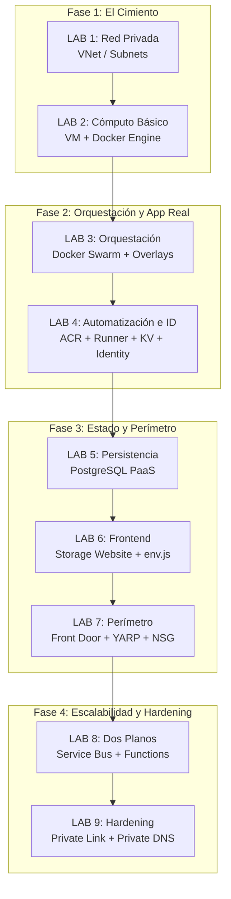

# Workshop: Cosmos Infrastructure — De Dev a Producción

> **Propósito:** Al completar este taller, cualquier desarrollador de Cosmos puede leer, entender y modificar cualquier módulo Terraform de producción, y puede enfrentarse a un nuevo requerimiento del Application Plane o del Control Plane sabiendo exactamente dónde tocar y por qué.

---

## 🎯 Las 9 Preguntas que Debes Poder Responder al Terminar

Este taller existe para responder con código ejecutable las preguntas que definen al Ingeniero de Plataforma de Cosmos:

1. **¿Por qué hay dos Service Buses?** (Lab 8 — ADR-009)
2. **¿Por qué YARP y no Azure Application Gateway?** (Lab 7 — ADR-003)
3. **¿Por qué la VM tiene SystemAssigned Identity?** (Lab 4)
4. **¿Cómo el Runner sabe el PAT sin tenerlo en código?** (Lab 4 — cloud-init + KV)
5. **¿Por qué el NSG solo permite `AzureFrontDoor.Backend:80`?** (Lab 7 — ADR-007)
6. **¿Cómo el frontend recibe la URL de la API sin recompilarse?** (Lab 6 — env.js desde KV)
7. **¿Qué hace Docker Swarm y por qué no contenedores directos?** (Lab 3)
8. **¿Qué pasa cuando un nuevo tenant se registra?** (Lab 8 — Control Plane)
9. **¿Por qué no puedo conectarme a la base de datos desde mi casa?** (Lab 9 — Hardening)

---

## 🏗️ El Mapa de la Infraestructura Completa

---

## 🚀 Orden de los Labs

| # | Lab | Qué construyes | Concepto Clave |
|---|---|---|---|
| **1** | [Cimentación](01_Lab_Foundation.md) | VNet + Subnets | Segmentación de red |
| **2** | [Cómputo Básico](02_Lab_Basic_Compute.md) | VM + Docker | El contenedor como unidad |
| **3** | [Orquestación](03_Lab_Orchestration.md) | Swarm + Overlays | Redes internas y Service Discovery |
| **4** | [Automatización e ID](04_Lab_Automation_and_Identity.md) | ACR + Runner + KV | Zero Secrets & Managed Identity |
| **5** | [Persistencia](05_Lab_Persistence_DB.md) | PostgreSQL Flexible | Desacoplamiento de estado |
| **6** | [Frontend](06_Lab_Frontend_Immutable.md) | Storage Static Website | Configuración de runtime (env.js) |
| **7** | [Perímetro](07_Lab_Edge_Gateway.md) | Front Door + YARP | Sello de seguridad NSG |
| **8** | [Dos Planos](08_Lab_Control_Plane.md) | Service Bus + Functions | App Plane vs Control Plane |
| **9** | [Hardening](09_Lab_Hardening.md) | Private Endpoints | Tráfico 100% privado |

---

## 🛠️ Pre-Requisitos
- **Azure CLI** (≥ 2.55)
- **Terraform** (≥ 1.5)
- **PAT de GitHub** con permisos de `workflow` y `admin:org` (para el Lab 4)
- **SSH Key** generada en tu máquina (`~/.ssh/id_rsa.pub`)

---

**➡️ Comienza aquí:** `01_Lab_Foundation.md`
