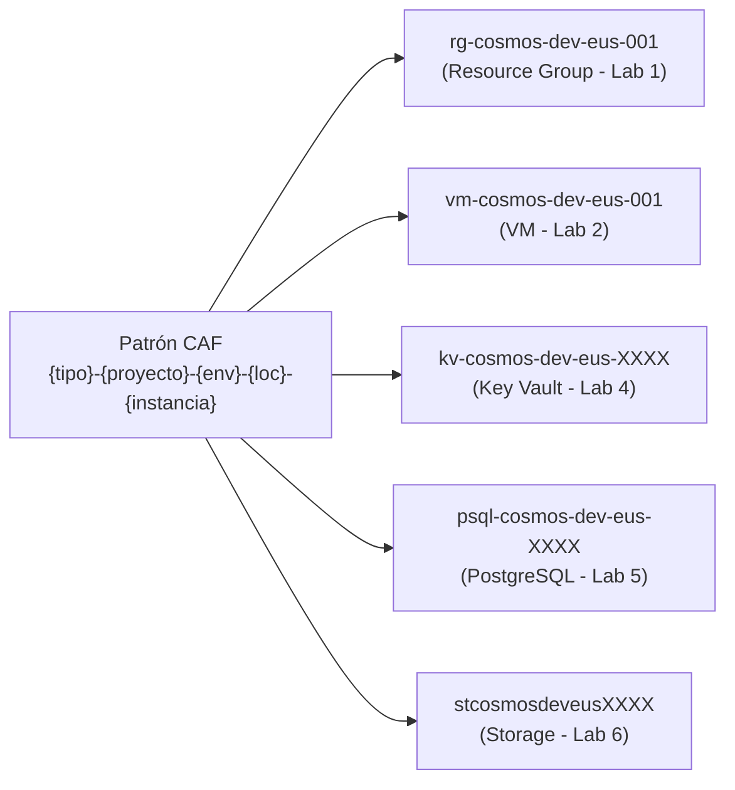
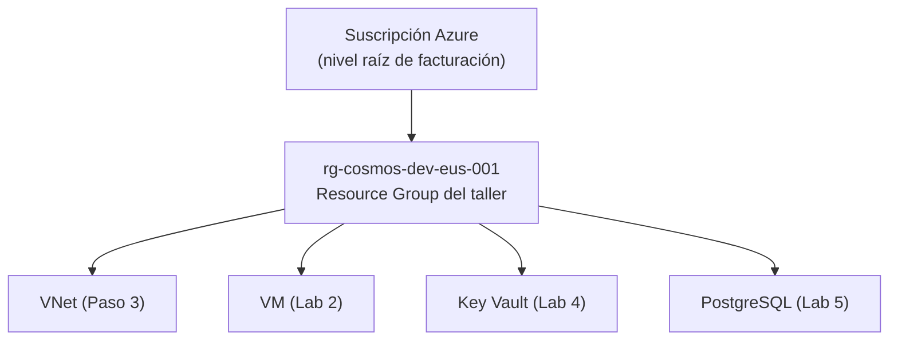
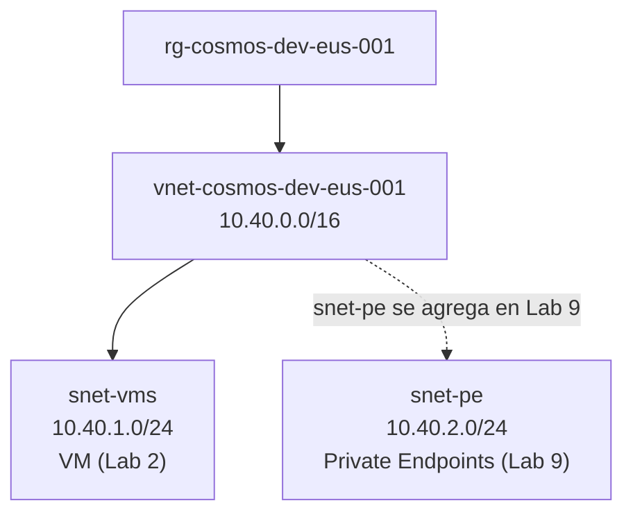

# Laboratorio 1: Cimentación — Naming, Red y Seguridad Perimetral

> **Objetivo:** Crear los tres pilares sobre los que descansa toda la infraestructura de Cosmos: el **contenedor lógico** (Resource Group), el **espacio de red privado** (VNet + Subnet) y el **guardián de tráfico** (NSG). Ningún servidor, base de datos o servicio puede existir sin estos tres cimientos.

---

## 📝 Paso 1: El Patrón de Naming (CAF)

### 🤔 El Problema
En Azure, algunos servicios tienen **nombres globalmente únicos** — si otra empresa ya usó `kv-produccion` como nombre de su Key Vault, tú no puedes usarlo. Sin una convención, cada desarrollador inventa sus propios nombres, haciendo imposible saber a qué proyecto, ambiente o región pertenece un recurso con solo verlo.

### 💡 La Solución
Cosmos adopta la **Cloud Adoption Framework (CAF)** naming convention de Microsoft. Es un patrón estructurado que hace los nombres autodescriptivos:

```
{tipo}-{proyecto}-{ambiente}-{región_corta}-{instancia}
```

Cada segmento tiene un propósito:

| Segmento | Propósito | Ejemplo |
|---|---|---|
| `tipo` | Abreviatura estándar del recurso Azure | `kv` = Key Vault, `vm` = Máquina Virtual, `rg` = Resource Group |
| `proyecto` | Identificador del producto o Bounded Context | `oxp` = ObligacionesPorPagar |
| `ambiente` | El ciclo de vida del recurso | `dev`, `qa`, `prod` |
| `región_corta` | Dónde vive el recurso en Azure | `eus` = East US |
| `instancia` | Diferencia múltiples copias del mismo recurso | `001`, `002` |

**Ejemplos reales de producción de Cosmos:**
- `kv-oxp-dev-eus-001` → Key Vault del proyecto ObligacionesPorPagar, ambiente dev, región East US
- `vm-oxp-dev-eus-001` → Máquina Virtual con el mismo patrón
- `psql-oxp-dev-eus-001` → PostgreSQL Flexible Server

En el taller, usaremos `cosmos` como proyecto y `taller` como sufijo para diferenciarlo de producción sin interferir con los recursos reales.

### 🧩 Consistencia en Todo el Ecosistema


> 📌 Nota sobre los sufijos `XXXX`: algunos servicios de Azure son globalmente únicos (Key Vault, Storage Account, ACR). Un sufijo aleatorio de 6 caracteres garantiza que el nombre sea tuyo. Terraform lo genera automáticamente con el recurso `random_string`.

### 🚀 Ejecución

Crea la carpeta del taller. **Todo el código del taller vivirá aquí, en un único `main.tf` que crece con cada lab.**

```bash
mkdir mi-cosmos && cd mi-cosmos
```

Crea el archivo `main.tf` con el bloque de configuración global:

```hcl
terraform {
  required_providers {
    azurerm = {
      source  = "hashicorp/azurerm"
      version = "~> 3.80"
    }
    random = {
      source  = "hashicorp/random"
      version = "~> 3.0"
    }
  }
}

provider "azurerm" {
  features {
    key_vault {
      purge_soft_delete_on_destroy    = true
      recover_soft_deleted_key_vaults = false
    }
  }
}

resource "random_string" "suffix" {
  length  = 6
  special = false
  upper   = false
}

data "azurerm_client_config" "current" {}
```

### 🧠 Desglose del Código: El Motor de Terraform

*   **`terraform {}`**: 
    Es el manifiesto de dependencias. Aquí le decimos a Terraform que descargue el plugin de Azure (`azurerm`) y el de generación de texto aleatorio (`random`).
*   **`provider "azurerm"`**: 
    Es el conector con tu suscripción. El bloque `features {}` es obligatorio; aquí configuramos que el Key Vault se borre por completo al destruir el taller para evitar costos residuales.
*   **`random_string`**: 
    En Azure, algunos servicios (como Key Vault o ACR) deben tener nombres **globalmente únicos** en todo el planeta. Este recurso nos genera un sufijo único (ej: `a1b2c3`) para que tus nombres no choquen con los de otros estudiantes.
*   **`azurerm_client_config`**: 
    Es un sensor que detecta quién eres tú (tu ID de usuario de Azure). Lo usaremos en el Lab 4 para darte permisos sobre el cofre de secretos.

Inicializa Terraform (descarga los plugins):

```bash
terraform init
```


Deberías ver algo como:
```
Terraform has been successfully initialized!
```

### 🔍 Comprobación
1. Verifica que se creó la carpeta `.terraform/` dentro de `mi-cosmos/` — ahí viven los providers descargados.
2. Ejecuta `terraform providers` — debe listar `registry.terraform.io/hashicorp/azurerm` y `registry.terraform.io/hashicorp/random`.

### 🌍 Realidad Cosmos
La convención CAF con `base_suffix = "${var.project_name}-${var.environment}-${var.location_short}-${var.instance}"` está declarada en `locals.tf` y se reutiliza en cada módulo. Código real: [`ObligacionesPorPagar.Infraestructura/infra/locals.tf`](file:///Users/didierymartinez/Documents/Sincosoft/Cosmos/cosmos/ObligacionesPorPagar.Infraestructura/infra/locals.tf).

---

## 📝 Paso 2: El Contenedor Lógico (Resource Group)

### 🤔 El Problema
En Azure, cada recurso que creas (VM, base de datos, Key Vault) existe en algún lugar. Sin una unidad de agrupación, tendrías decenas de recursos mezclados en tu suscripción sin ningún orden — como tener todos los archivos de tu computadora en el escritorio.

### 💡 La Solución
El **Resource Group (RG)** es el **contenedor lógico** de Azure. Agrupa recursos que comparten:
- **Ciclo de vida**: cuando destruyes el RG, destruyes todos sus recursos juntos.
- **Permisos**: los roles de Azure AD se pueden asignar a nivel de RG (afectan todos sus recursos).
- **Tags**: metadatos que permiten filtrar por proyecto, equipo o centro de costos.
- **Región**: aunque los recursos dentro del RG pueden estar en distintas regiones, el RG mismo tiene una región (donde se almacena el metadata).

En Cosmos, cada Bounded Context tiene su propio RG. Esto significa que el equipo de ObligacionesPorPagar puede destruir y recrear su entorno sin afectar al equipo de Contabilidad.

### 🧩 Posición en la Jerarquía


### 🚀 Ejecución

**Agrega esto a tu `main.tf`** (debajo de la sección de configuración global):

```hcl
resource "azurerm_resource_group" "rg" {
  name     = "rg-cosmos-dev-eus-001"
  location = "East US"

  tags = {
    workload    = "cosmos-taller"
    environment = "dev"
    managedBy   = "terraform"
  }
}
```

### 🧠 Desglose del Código: El Contenedor de Vida

*   **¿Qué es un Resource Group?**: 
    Es una "caja" lógica. Todo lo que crees en Azure debe vivir dentro de una caja. Si borras la caja, borras todo lo que hay dentro. Es la forma más limpia de gestionar el ciclo de vida de un proyecto.
*   **Tags (Etiquetas)**: 
    Son metadatos. En Cosmos, la etiqueta `managedBy = terraform` es sagrada: le advierte a cualquier humano que entre al portal de Azure que **no debe tocar nada a mano**, porque Terraform sobreescribirá sus cambios.


Aplica:

```bash
# terraform plan muestra qué va a crear, modificar o destruir — sin tocar Azure.
# Siempre revisa el plan antes de aplicar.
terraform plan

# terraform apply ejecuta el plan. Escribe 'yes' cuando lo pida.
terraform apply
```

Verás algo como:
```
Plan: 2 to add, 0 to change, 0 to destroy.
  + azurerm_resource_group.rg
  + random_string.suffix
```

### 🔍 Comprobación
1. Ve a [portal.azure.com](https://portal.azure.com) → busca **"Resource groups"** en el buscador superior.
2. Verifica que `rg-cosmos-taller` aparece en la lista con **Location = East US**.
3. Haz clic en el RG → en la pestaña **Overview**, busca la sección **Tags** → debe mostrar `managedBy: terraform`.
4. La columna **Resources** debe mostrar `0 resources` — el contenedor está vacío por ahora.

### 🌍 Realidad Cosmos
En producción, los tags incluyen además `owner` (equipo responsable) y `costCenter` (para el chargeback de facturación). Ambos son **requeridos** — el pipeline de CI falla si no se proveen. Ver [`variables.tf L31-L40`](file:///Users/didierymartinez/Documents/Sincosoft/Cosmos/cosmos/ObligacionesPorPagar.Infraestructura/infra/variables.tf).

---

## 📝 Paso 3: La Red Privada (VNet y Subnet)

### 🤔 El Problema
Cuando creas una VM en Azure, Azure le asigna una **IP privada** dentro de la red en la que vive. Esa IP privada no es accesible desde internet — solo desde dentro de la misma red.

En Cosmos, las VMs **nunca tienen IP pública**. Este principio se llama **Zero Public IP**: ningún servidor de cómputo es directamente alcanzable desde internet. Si no hay IP pública, el atacante no tiene superficie donde golpear.

Pero tener una red privada no es suficiente. El tráfico **dentro** de la VNet tampoco debe fluir sin restricciones — necesitamos un mecanismo que decida explícitamente qué conexiones están permitidas y cuáles no. Eso lo veremos en el siguiente paso.


### 💡 La Solución: La Virtual Network (VNet)
La **VNet** es tu red privada en Azure — equivalente a la LAN de tu empresa, pero en la nube. Define un rango de IPs que solo existen dentro de tu suscripción. Nadie externo puede ver ni enrutar a estas IPs directamente.

**¿Qué significa `10.40.0.0/16`?**
- Es la notación CIDR (Classless Inter-Domain Routing) para definir un rango de IPs.
- `/16` significa que los primeros 16 bits son fijos (`10.40`), y los últimos 16 bits son variables.
- Esto da **65,534 IPs disponibles**: desde `10.40.0.1` hasta `10.40.255.254`.
- Suficiente para toda la infraestructura de un Bounded Context con margen para crecer.

### 💡 La Solución: Las Subnets
Una VNet es un espacio enorme. Las **Subnets** lo dividen en segmentos más pequeños según su propósito. En este lab creamos la subnet que necesitamos ahora: `snet-vms`, donde vivirá la VM en el Lab 2. À medida que el taller avance, iremos agregando subnets cuando su necesidad sea concreta:

- `snet-vms` (`10.40.1.0/24`) → **se crea ahora** — es el hogar de la VM (Lab 2). À medida que el taller avance, iremos agregando subnets cuando su necesidad sea concreta:
- `snet-pe` (`10.40.2.0/24`) → se creará en el **Lab 9**, cuando los Private Endpoints lo necesiten.

La separación en subnets permite aplicar políticas de seguridad distintas a cada segmento. Cuando tengamos Front Door configurado (Lab 7), asociaremos un NSG a `snet-vms` para controlar qué tráfico puede llegar a los servidores.


### 🧩 Estructura de la Red



### 🚀 Ejecución

**Agrega esto a tu `main.tf`**:

```hcl
# 1. La Virtual Network (VNet)
resource "azurerm_virtual_network" "vnet" {
  name                = "vnet-cosmos-dev-eus-001"
  address_space       = ["10.40.0.0/16"]
  location            = azurerm_resource_group.rg.location
  resource_group_name = azurerm_resource_group.rg.name
  tags                = azurerm_resource_group.rg.tags
}

# 2. La Subnet de Cómputo (snet-vms)
resource "azurerm_subnet" "vm_subnet" {
  name                 = "snet-vms"
  resource_group_name  = azurerm_resource_group.rg.name
  virtual_network_name = azurerm_virtual_network.vnet.name
  address_prefixes     = ["10.40.1.0/24"]
}

# 3. El Guardián de la Red (NSG)
resource "azurerm_network_security_group" "vm_nsg" {
  name                = "nsg-cosmos-dev-eus-001"
  location            = azurerm_resource_group.rg.location
  resource_group_name = azurerm_resource_group.rg.name
  tags                = azurerm_resource_group.rg.tags

  security_rule {
    name                       = "AllowSSH"
    priority                   = 100
    direction                  = "Inbound"
    access                     = "Allow"
    protocol                   = "Tcp"
    source_port_range          = "*"
    destination_port_range     = "22"
    source_address_prefix      = "*"
    destination_address_prefix = "*"
  }

  security_rule {
    name                       = "AllowHTTP"
    priority                   = 110
    direction                  = "Inbound"
    access                     = "Allow"
    protocol                   = "Tcp"
    source_port_range          = "*"
    destination_port_range     = "80"
    source_address_prefix      = "*"
    destination_address_prefix = "*"
  }
}

# 4. El Vínculo: Asociar el NSG a la Subnet
resource "azurerm_subnet_network_security_group_association" "vm_nsg_assoc" {
  subnet_id                 = azurerm_subnet.vm_subnet.id
  network_security_group_id = azurerm_network_security_group.vm_nsg.id
}
```

### 🧠 Desglose del Código: Los Cimientos de Red

*   **VNet (`10.40.0.0/16`)**: 
    Es tu burbuja privada en la nube. Nadie puede ver lo que hay dentro a menos que tú abras un túnel. El rango `/16` te da más de 65,000 IPs, espacio de sobra para escalar Cosmos a nivel global.
*   **Subnet (`10.40.1.0/24`)**: 
    Es un "pasillo" dentro de tu burbuja. Al poner a las VMs en su propia subnet, podemos poner un guardia en la puerta del pasillo sin afectar al resto de la red.
*   **NSG (Network Security Group)**: 
    Es el guardia. Por defecto, Azure bloquea todo el tráfico entrante. Aquí estamos abriendo explícitamente el puerto **22 (SSH)** para que tú puedas entrar a configurar, y el puerto **80 (HTTP)** para que el mundo pueda ver tu app.
*   **Association**: 
    Un NSG no hace nada por sí solo. Debes "amarrarlo" a una subnet para que el guardia empiece a vigilar el tráfico de todos los recursos que vivan en ese pasillo.


Aplica:

```bash
terraform apply
# Terraform creará 2 recursos nuevos (VNet + Subnet). Escribe 'yes'.
```

### 🔍 Comprobación
1. Portal → `rg-cosmos-taller` → verifica que ahora hay **3 resources** (RG + VNet + Subnet).
2. Haz clic en `vnet-cosmos` → en **Address space** → debe mostrar `10.40.0.0/16`.
3. Ve a **Subnets** → verifica que `snet-vms` aparece con el rango `10.40.1.0/24`.
4. Verifica que `snet-vms` no tiene ningún **Security group** asociado aún — el NSG se creará en el Lab 7, cuando sepamos exactamente qué tráfico debe permitir.

### 🌍 Realidad Cosmos
En el módulo de producción, los rangos están declarados como variables en `variables.tf`. El NSG y sus reglas se crean en el mismo módulo de networking junto con Front Door, porque las reglas del NSG referencian el service tag de Front Door — son dos conceptos que deben definirse juntos. Código real: [`variables.tf L42-L52`](file:///Users/didierymartinez/Documents/Sincosoft/Cosmos/cosmos/ObligacionesPorPagar.Infraestructura/infra/variables.tf).

---

**➡️ Siguiente Paso:** Ahora que tenemos la red, necesitamos una máquina donde ejecutar nuestras aplicaciones. Abre `02_Lab_Basic_Compute.md`.
