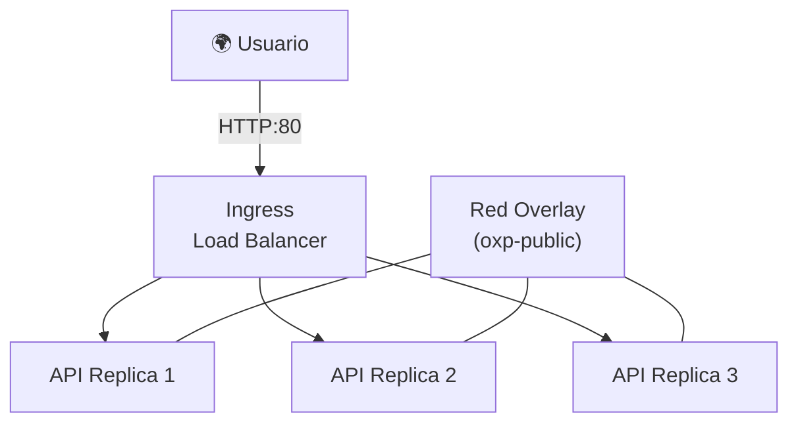

# Laboratorio 3: Orquestación — Docker Swarm y Redes Overlay

> **Objetivo:** Transformar nuestra VM en un clúster de orquestación. Aprenderemos a desplegar aplicaciones usando **Stacks** (archivos declarativos) y a aislar el tráfico entre microservicios usando **Redes Overlay**.

---

## 💡 El Mapa: De Contenedores a Orquestación

### 🤔 El Problema
Correr contenedores con `docker run` (como hicimos en el lab anterior) es genial para pruebas, pero en un entorno real tiene grandes fallas:
1. **Mantenimiento**: Si el contenedor muere, nadie lo reinicia.
2. **Escalabilidad**: ¿Cómo corres 5 copias de tu API sin que choquen sus puertos?
3. **Redes**: Conectar contenedores entre sí requiere gestionar IPs manuales.

### 💡 La Solución: El Orquestador
En Cosmos usamos **Docker Swarm**. Es como un "director de orquesta" que:
- Mantiene el **estado deseado** (si pides 3 réplicas, él se asegura de que existan).
- Provee **Redes Overlay** (redes virtuales que cruzan varias máquinas).
- Permite hacer **Rolling Updates** (actualizar tu app sin que el usuario deje de verla).



---

## 📝 Paso 1: Inicialización de Docker Swarm

### 🤔 El Problema
En el Lab anterior usamos `docker run`. Si queremos desplegar 3 instancias de una API para alta disponibilidad, tendríamos que ejecutar el comando 3 veces y gestionar el balanceo de carga nosotros mismos.

### 💡 La Solución
**Docker Swarm** convierte la VM en un "manager" que se encarga de mantener el estado deseado. Si le decimos "quiero 3 réplicas", Swarm se asegura de que siempre haya 3 réplicas corriendo.

### 🚀 Ejecución

**Actualiza el `custom_data` de tu VM en `main.tf`** para inicializar el Swarm automáticamente:

```hcl
resource "azurerm_linux_virtual_machine" "vm" {
  # ... (mantén el resto de los campos igual que en el Lab 2) ...
  # Pero actualiza el bloque custom_data:

  custom_data = base64encode(<<-EOF
    #cloud-config
    package_update: true
    packages:
      - docker.io
    runcmd:
      - systemctl enable --now docker
      - usermod -aG docker azureuser
      - docker swarm init --advertise-addr $(hostname -I | awk '{print $1}')
      - docker network create --driver overlay --attachable oxp-public
      - docker network create --driver overlay --attachable oxp-internal
  EOF
  )
}
```

Aplica:

```bash
terraform apply -var-file=terraform.tfvars
```

### 🧠 Desglose del Código: El Director de Orquesta

*   **`docker swarm init`**: 
    Este comando convierte a tu VM en un **Manager** de un clúster. Aunque ahora solo tenemos un nodo, Swarm ya nos da superpoderes como el balanceo de carga interno y la autorrecuperación de contenedores.
*   **Redes Overlay**: 
    A diferencia de las redes estándar de Docker que solo viven dentro de una máquina, las redes `overlay` pueden extenderse a múltiples máquinas. Son el cimiento de la escalabilidad de Cosmos.
*   **`oxp-public` vs `oxp-internal`**: 
    En Cosmos aplicamos **Aislamiento por Capas**. La red `public` es para los servicios que el mundo verá (vía el Gateway). La red `internal` es exclusiva para que los microservicios hablen con sus bases de datos o entre ellos, sin que nadie desde fuera pueda siquiera intentar conectarse.


### 🔍 Comprobación: Clúster y Redes Overlay
Entra a tu VM por SSH y verifica qué creó el script automáticamente:

1. **Estado del Swarm**:
   ```bash
   docker info | grep Swarm
   # Debe decir: Swarm: active
   ```
2. **Nodo Manager**:
   ```bash
   docker node ls
   # Debe listar tu VM con Status 'Ready'.
   ```
3. **Las Redes de Cosmos**:
   ```bash
   docker network ls | grep oxp
   ```
   > 💡 **¿Por qué dos redes?** En Cosmos aislamos el tráfico:
   > - **`oxp-public`**: Para servicios que reciben tráfico de internet (vía Gateway).
   > - **`oxp-internal`**: Para comunicación privada (ej: API → DB).
   >
   > Al ser de tipo **Overlay**, estas redes permiten que los contenedores hablen entre ellos aunque estén en diferentes máquinas (escalabilidad).

---

## 📝 Paso 2: Despliegue con Stacks (`stack.yml`)

### 🤔 El Problema
Gestionar comandos `docker service create` largos es propenso a errores. Necesitamos un archivo que describa toda nuestra aplicación: qué imágenes usa, cuántas réplicas, en qué red vive y qué límites tiene.

### 💡 La Solución: Docker Stack
Usamos un archivo `stack.yml` (formato Docker Compose) para desplegar el conjunto de servicios.

### 🚀 Ejecución

1. Entra a la VM por SSH.
2. Crea un archivo llamado `stack.demo.yml`:
```yaml
version: '3.8'
services:
  whoami:
    image: traefik/whoami
    ports:
      - "80:80"
    networks:
      - oxp-public
    deploy:
      replicas: 2
      update_config:
        parallelism: 1
        delay: 10s

networks:
  oxp-public:
    external: true
```
3. Despliega el stack:
```bash
docker stack deploy -c stack.demo.yml demo
```

### 🔍 Comprobación
1. **Verifica los servicios**:
   ```bash
   docker stack services demo
   # Deberías ver 'demo_whoami' con 2/2 réplicas y el puerto *:80->80/tcp
   ```
2. **¡Al Navegador!**:
   Abre tu navegador y ve a `http://<IP_DE_TU_VM>`.
   > 💡 **Lo que verás**: Verás un texto con información del contenedor. Si refrescas varias veces, notarás que el `Hostname` o la `IP` cambian — ¡Docker Swarm está balanceando la carga entre tus dos réplicas automáticamente!

---

---

**🏆 ¡Felicidades!** Has transformado una VM estática en un clúster dinámico.

**🤔 Sin embargo, queda una duda:**
Ya tenemos orquestación, pero el proceso sigue siendo manual: entrar por SSH, crear un YAML y desplegar. **¿Vamos a hacer esto cada vez que un desarrollador suba código? ¿Cómo construimos una tubería de Integración Continua (CI) que sea automática y segura?**

**➡️ Descúbrelo en el siguiente lab:** Abre `04_Lab_Automation_and_Identity.md`.
