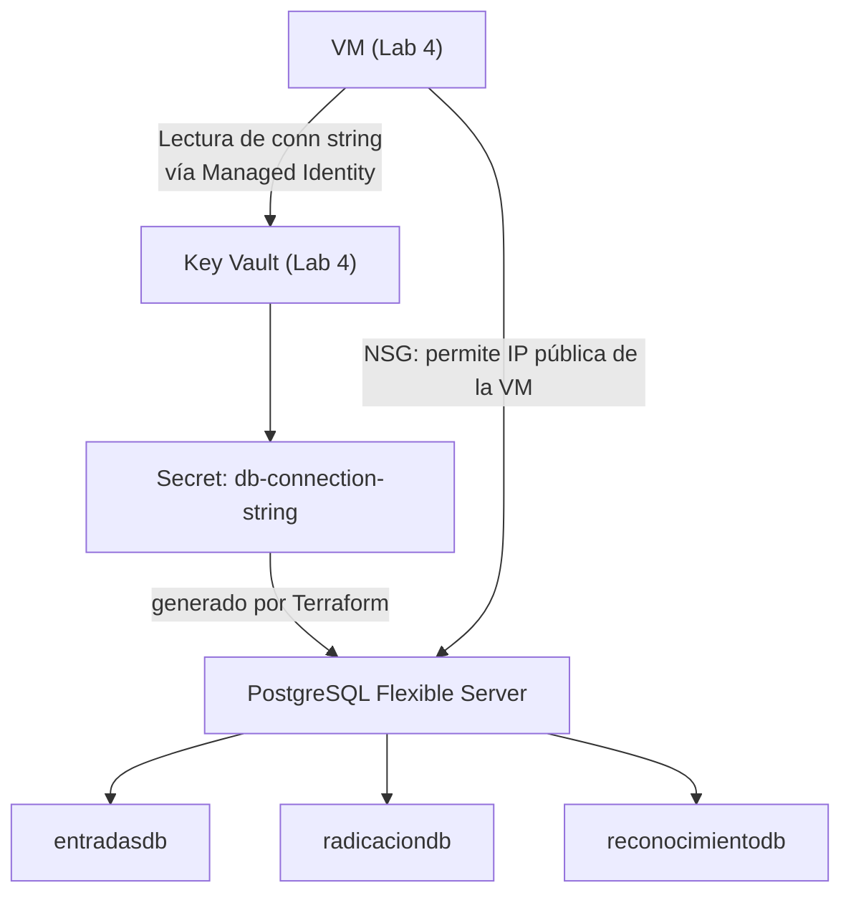

# Laboratorio 6: Persistencia — PostgreSQL PaaS y el Ciclo de Secretos

> **Objetivo:** Desacoplar el estado (datos) del cómputo. La base de datos existe independientemente de la VM — si esta se destruye y recrea, los datos persisten. Los secretos de conexión fluyen automáticamente al Key Vault sin que ningún desarrollador los vea.

---

## 📝 Paso 1: El Servidor de Base de Datos (PostgreSQL Flexible Server)

### 🤔 El Problema
Si la base de datos vive dentro de la VM (como proceso), cuando la VM falla o se recrea, pierdes todos los datos. Además, escalar la base de datos implicaría escalar toda la VM aunque el cuello de botella sea solo almacenamiento.

### 💡 La Solución
**Azure Database for PostgreSQL Flexible Server** es un servicio PaaS totalmente gestionado. Azure maneja el backup automático, los parches de seguridad del motor y la alta disponibilidad. Tu responsabilidad se limita a definir el schema y las aplicaciones que se conectan.

En producción, cada Bounded Context de Cosmos tiene su propia base de datos dentro del servidor: `entradasdb`, `radicaciondb`, `radicaciondb_vectorial`, `reconocimientodb`. El aislamiento por base de datos garantiza que una migración en `radicaciondb` no puede corromper datos de `entradasdb`.

### 🧩 Jerarquía en Cosmos


### 🚀 Ejecución

**Agrega esto a tu `main.tf`**:

```hcl
# 1. Generar una contraseña segura y aleatoria
resource "random_password" "db_password" {
  length           = 24
  special          = true
  override_special = "!#$%&*()-_=+[]{}<>:?"
}

# 2. Servidor PostgreSQL Flexible
resource "azurerm_postgresql_flexible_server" "db" {
  name                   = "psql-cosmos-dev-eus-${random_string.suffix.result}"
  resource_group_name    = azurerm_resource_group.rg.name
  location               = azurerm_resource_group.rg.location
  version                = "17" 
  administrator_login    = "cosmosadmin"
  administrator_password = random_password.db_password.result

  storage_mb   = 32768
  sku_name     = "B_Standard_B2s"

  tags = azurerm_resource_group.rg.tags
}

# 3. Bases de Datos para los Bounded Contexts
resource "azurerm_postgresql_flexible_server_database" "radicacion" {
  name      = "radicaciondb"
  server_id = azurerm_postgresql_flexible_server.db.id
  charset   = "UTF8"
  collation = "en_US.utf8"
}

resource "azurerm_postgresql_flexible_server_database" "reconocimiento" {
  name      = "reconocimientodb"
  server_id = azurerm_postgresql_flexible_server.db.id
  charset   = "UTF8"
  collation = "en_US.utf8"
}
```

### 🧠 Desglose del Código: ¿Qué estamos construyendo?

*   **`random_password`**: 
    En lugar de inventar una contraseña y escribirla en el código (donde cualquiera con acceso al repositorio podría verla), le pedimos a Terraform que genere una de 24 caracteres con símbolos especiales. Esta contraseña solo vivirá en la memoria de Terraform y en el Key Vault que configuraremos más adelante.
*   **¿Qué es un "Flexible Server" (PaaS)?**: 
    A diferencia de instalar PostgreSQL dentro de una VM (IaaS), un Flexible Server es un servicio **gestionado**. Microsoft se encarga de que el motor de base de datos siempre esté encendido, de hacer los backups cada noche y de aplicar parches de seguridad. Tú solo consumes el servicio.
*   **Aislamiento por Base de Datos**: 
    Nota que creamos un solo *Servidor*, pero múltiples *Bases de Datos* (`radicaciondb`, `reconocimientodb`). En Cosmos, esto nos permite que cada equipo de desarrollo sea dueño de su propia base de datos, evitando que un error en un microservicio afecte los datos del otro.
*   **SKU `B_Standard_B2s`**: 
    La "B" significa *Burstable*. Son máquinas económicas ideales para desarrollo porque permiten "picos" de procesamiento pero cuestan una fracción de lo que costaría un servidor de producción.


Aplica:

```bash
terraform apply -var-file=terraform.tfvars
# PostgreSQL tarda ~5-8 minutos en crearse. Escribe 'yes'.
```

### 🔍 Comprobación
1. Portal → `rg-cosmos-dev-eus-001` → haz clic en el recurso de tipo **Azure Database for PostgreSQL flexible server**.
2. En **Overview** verifica: Version = `17`, Compute + storage muestra `Standard_B2s`.
3. En el panel izquierdo → **Databases** → verifica que existen `radicaciondb` y `reconocimientodb`.
4. Anota el **Server name** (ej: `psql-cosmos-taller-8xk2m3.postgres.database.azure.com`).

### 🌍 Realidad Cosmos
En producción se usa `B_Standard_B2s` en dev y SKUs de producción para prod. El módulo también habilita la extensión `pgvector` para la base de datos de IA. Módulo real: [`ObligacionesPorPagar.Infraestructura/infra/modules/postgres/`](file:///Users/didierymartinez/Documents/Sincosoft/Cosmos/cosmos/ObligacionesPorPagar.Infraestructura/infra/modules/postgres/).

---

## 📝 Paso 2: Los Secretos de Persistencia en el Key Vault

### 🤔 El Problema
Los microservicios que corren en Docker Swarm (dentro de la VM del Lab 3) necesitan conectarse a la base de datos. ¿Cómo saben la contraseña? Si la hardcodeamos en el `appsettings.json` de la aplicación, está en el código fuente para siempre.

### 💡 La Solución (Flujo Automático de Secretos)
Terraform conoce la contraseña porque la generó (`random_password`). En el mismo apply, Terraform crea un secreto en el Key Vault con esa contraseña. La aplicación, en tiempo de ejecución, lee la contraseña del Key Vault usando la Managed Identity de la VM. **La contraseña nunca aparece en el código, ni en variables de entorno, ni en archivos de configuración del OS.**

```mermaid
sequenceDiagram
    participant TF as Terraform apply
    participant KV as Key Vault
    participant VM as VM (Managed Identity)
    participant App as App en Docker Swarm
    
    TF->>TF: random_password genera "K#mP9...!"
    TF->>KV: Secret "db-admin-password" = "K#mP9...!"
    TF->>KV: Secret "db-connection-string" = "Host=psql-...postgres.database.azure.com;..."
    
    App->>VM: Solicita credenciales
    VM->>KV: az keyvault secret show "db-connection-string"
    KV-->>VM: "Host=psql-...;Password=K#mP9...!"
    VM-->>App: Connection string
    App->>DB: Conecta con la string obtenida
```

### 🚀 Ejecución

**Agrega esto a tu `main.tf`**:

```hcl
# 1. Guardar la contraseña en el Key Vault
resource "azurerm_key_vault_secret" "db_password" {
  name         = "db-admin-password"
  value        = random_password.db_password.result
  key_vault_id = azurerm_key_vault.kv.id
}

# 2. Guardar la cadena de conexión completa
resource "azurerm_key_vault_secret" "db_connection_string" {
  name  = "db-connection-string"
  value = "Host=${azurerm_postgresql_flexible_server.db.fqdn};Database=radicaciondb;Username=cosmosadmin;Password=${random_password.db_password.result};Ssl Mode=Require;"
  key_vault_id = azurerm_key_vault.kv.id
}
```

### 🧠 Desglose del Código: El Flujo del Secreto

*   **¿Por qué guardamos la `db-connection-string` completa?**
    Facilitamos la vida de la aplicación. En lugar de que el código tenga que armar la URL (buscando el host, el puerto y el password por separado), la aplicación simplemente pide el secreto `db-connection-string` y ya tiene todo lo necesario para conectar.
*   **La inyección del Password**:
    Observa cómo usamos `${random_password.db_password.result}` dentro del valor del secreto. Terraform toma el valor generado aleatoriamente en el Paso 1 y lo deposita de forma segura en el "cofre" (Key Vault). 
*   **Cero Intervención Humana**:
    Este es el estándar de Cosmos. Ni tú, ni el desarrollador, ni el operador necesitan conocer la contraseña de la base de datos. Solo el **Service Principal** de la VM (Lab 4) tiene permiso para leerla.


Aplica:

```bash
terraform apply -var-file=terraform.tfvars
```

### 🔍 Comprobación
1. Portal → Key Vault → **Secrets** → verifica que ahora hay 3 secretos:
   - `github-pat` (Lab 2)
   - `db-admin-password`
   - `db-connection-string`
2. Haz clic en `db-connection-string` → **Current version** → **Show Secret Value** → verifica que el FQDN del servidor aparece en el valor.
3. Desde la VM (SSH), verifica que puede leer el secreto:
   ```bash
   az login --identity
   az keyvault secret show --vault-name kv-cosmos-dev-eus-XXXX --name db-connection-string --query value -o tsv
   # Debe mostrar la cadena de conexión completa
   ```

### 🌍 Realidad Cosmos
En producción, el módulo `key_vault` recibe `postgres_admin_password`, `pg_fqdn` y `pg_databases` como inputs y crea los secretos para cada bounded context. El `pg_databases` es una lista: `["entradasdb", "radicaciondb", "radicaciondb_vectorial", "reconocimientodb"]`. Ver [`main.tf L80-L93`](file:///Users/didierymartinez/Documents/Sincosoft/Cosmos/cosmos/ObligacionesPorPagar.Infraestructura/infra/main.tf).

---

## 📝 Paso 3: El Perímetro de la Base de Datos (Firewall)

### 🤔 El Problema
El PostgreSQL Flexible Server es un servicio PaaS con un endpoint público (`*.postgres.database.azure.com`). Sin restricciones, cualquier IP del mundo puede intentar conectarse. El firewall del servidor es la primera línea de defensa.

### 💡 La Solución
Configuramos una regla de firewall que solo permite la IP pública de nuestra VM. En producción, esto se reemplaza con Private Link (Lab 8) — el servidor deja de ser público del todo.

### 🚀 Ejecución

**Agrega esto a tu `main.tf`**:

```hcl
resource "azurerm_postgresql_flexible_server_firewall_rule" "allow_vm" {
  name             = "allow-vm-ip"
  server_id        = azurerm_postgresql_flexible_server.db.id
  start_ip_address = azurerm_public_ip.vm_pip.ip_address
  end_ip_address   = azurerm_public_ip.vm_pip.ip_address
}
```

### 🧠 Desglose del Código: ¿Para qué sirve esto?

*   **Endpoint Público vs. Acceso Privado**: 
    Por defecto, un Flexible Server tiene una dirección de internet pública. Sin embargo, Azure bloquea TODO el tráfico entrante. Esta regla de firewall es como un "vigilante" que solo deja pasar paquetes que vengan desde la IP de nuestra VM (`azurerm_public_ip.vm_pip.ip_address`). Cualquier otra conexión desde cualquier lugar del mundo será rechazada.
*   **Próximos Pasos (Hacia Producción)**:
    En un entorno de producción real, este firewall se apaga y se usa un **Private Endpoint**. Eso lo veremos en el Lab 8, donde la base de datos ya no tendrá IP pública y solo se podrá ver desde "dentro" de la red virtual.


Aplica:

```bash
terraform apply -var-file=terraform.tfvars
```

### 🔍 Comprobación
1. Portal → PostgreSQL → **Networking** → verifica que la regla `allow-vm-ip` aparece con la IP de la VM.
2. Desde la VM, verifica la conexión (requiere que `psql` esté instalado):
   ```bash
   CONN=$(az keyvault secret show --vault-name kv-cosmos-dev-eus-XXXX --name db-connection-string --query value -o tsv)
   psql "$CONN" -c "SELECT version();"
   # Debe responder con la versión de PostgreSQL 17
   ```

### 🌍 Realidad Cosmos
En producción (`B_Standard_B2s` ya no — se usa SKU más grande) la regla de firewall solo permite la IP de la VM. El Private Endpoint del Lab 8 hace que la IP del servidor sea privada (`10.40.1.X`), eliminando la necesidad de reglas de firewall externas.

---

**🏆 ¡Felicidades!** Los datos de Cosmos ya no son volátiles. Ahora tienes una base de datos segura, gestionada y conectada mediante identidades.

**🤔 Sin embargo, queda una duda:**
Tenemos la lógica y los datos, pero... **¿Cómo los consume el usuario? ¿Vamos a crear otra VM solo para servir archivos HTML y JS? ¿Cómo logramos que el frontend sea inmutable y se configure solo sin recompilar código?**

**➡️ Descúbrelo en el siguiente lab:** Abre `07_Lab_Frontend_Immutable.md`.
