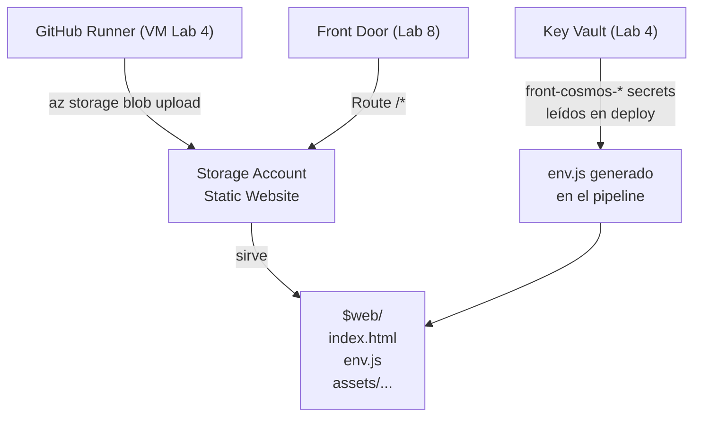

# Laboratorio 7: Frontend Inmutable — Storage Account y env.js

> **Objetivo:** Desplegar el frontend como un artefacto estático inmutable. La configuración de runtime (URLs de API, IDs de autenticación) no viaja en el código fuente — se inyecta desde el Key Vault en el momento del despliegue, sin recompilar.

---

## 📝 Paso 1: El Almacén de Artefactos Estáticos (Storage Account)

### 🤔 El Problema
Un frontend (React/Vue/Angular compilado) es solo HTML, CSS y JavaScript. No necesita un servidor web que interprete código — solo necesita que alguien sirva archivos estáticos. Crear una VM solo para servir archivos estáticos es un desperdicio de recursos y complejidad.

### 💡 La Solución
Azure Storage Account tiene una función llamada **Static Website** que sirve archivos estáticos directamente desde Blob Storage, sin servidores. El contenedor especial `$web` es el directorio raíz del sitio.

En Cosmos, el Storage Account de fronts es **transversal** — no pertenece a un solo Bounded Context. Todos los fronts del ecosistema viven bajo `$web/{app_name}/`. Por ejemplo:
- `$web/oxp/` → ObligacionesPorPagar.Front
- `$web/contabilidad/` → Cosmos.Contabilidad front

### 🧩 Jerarquía en Cosmos



### 🚀 Ejecución

**Agrega esto a tu `main.tf`**:

```hcl
resource "azurerm_storage_account" "frontend" {
  name                     = "stcosmosdeveus${random_string.suffix.result}"
  resource_group_name      = azurerm_resource_group.rg.name
  location                 = azurerm_resource_group.rg.location
  account_tier             = "Standard"
  account_replication_type = "LRS"
  tags                     = azurerm_resource_group.rg.tags

  static_website {
    index_document     = "index.html"
    error_404_document = "index.html"
  }
}
```

### 🧠 Desglose del Código: ¿Qué es el hosting estático?

*   **¿Por qué un Storage Account?**: 
    Servir archivos estáticos (HTML, JS, imágenes) desde una VM es ineficiente; estarías pagando por CPU y RAM para algo que solo requiere ancho de banda. El Storage Account es **Serverless**: Azure se encarga de todo el escalado y tú solo pagas por los bytes que los usuarios descargan.
*   **`static_website`**: 
    Al habilitar este bloque, Azure crea automáticamente un contenedor oculto llamado `$web`. Cualquier archivo que subas ahí será accesible a través de una URL web.
*   **`error_404_document = "index.html"`**: 
    Esto es vital para las aplicaciones modernas (SPA). Como el ruteo ocurre dentro del navegador (JavaScript), si un usuario refresca la página en `/dashboard`, Azure no encontrará el archivo físico. Al redirigir el 404 al `index.html`, permitimos que la aplicación JavaScript tome el control y muestre la ruta correcta.


Aplica:

```bash
terraform apply -var-file=terraform.tfvars
```

### 🔍 Comprobación
1. Portal → `rg-cosmos-dev-eus-001` → haz clic en el recurso de tipo **Storage account**.
2. En el panel izquierdo → **Data management** → **Static website** → verifica que **Status** = `Enabled`.
3. Anota la **Primary endpoint** (ej: `https://stcosmosdeveus8xk2m3.z13.web.core.windows.net/`). Esta es la URL pública del frontend.
4. Ve a **Data storage** → **Containers** → verifica que existe el contenedor `$web`.

### 🌍 Realidad Cosmos
El Storage Account de fronts en producción vive en un Resource Group transversal `applicationplane` gestionado por el repo `ApplicationPlane`. Todos los fronts del ecosistema coexisten en el mismo Storage Account. Ver [`ApplicationPlane/infraestructure/`](file:///Users/didierymartinez/Documents/Sincosoft/Cosmos/cosmos/ApplicationPlane/infraestructure/).

---

## 📝 Paso 2: Los Secretos de Runtime del Frontend (env.js)

### 🤔 El Problema
El frontend necesita saber: ¿Dónde está el hub de SignalR? ¿Cuál es el Client ID de WorkOS para autenticarse? Estos valores cambian entre dev y prod. Si van hardcodeados en el código JavaScript, hay que recompilar el frontend para cada ambiente. Si van en el `index.html`, están expuestos al usuario del navegador (aunque sean identificadores públicos, no secretos).

### 💡 La Solución (Patrón env.js de Cosmos)
El frontend carga un archivo `env.js` antes de ejecutar su lógica. Este archivo asigna valores a `window.RUNTIME_CONFIG`. El código JavaScript lee de ahí. El archivo `env.js` **no existe en el repositorio del frontend** — se genera en el momento del deploy leyendo valores del Key Vault.

Flujo:
1. Terraform siembra en el KV los secretos `front-cosmos-signalr-hub-url`, `front-cosmos-workos-client-id`.
2. El pipeline de CI del frontend (corriendo en el Runner del Lab 3) lee esos secretos del KV.
3. El pipeline genera el `env.js` con los valores reales.
4. El pipeline sube el `env.js` al Storage Account.
5. El navegador descarga `env.js` antes que cualquier otro JS de la app.

### 🚀 Ejecución

**Agrega las variables y los secretos del frontend a tu `main.tf`**:

```hcl
variable "frontend_signalr_hub_url" {
  description = "Path del hub SignalR para notificaciones"
  type        = string
  default     = "/notificaciones/hub"
}

variable "frontend_workos_client_id" {
  description = "Client ID público de WorkOS"
  type        = string
  default     = "client_XXXX_cambia_esto"
}

resource "azurerm_key_vault_secret" "front_signalr_hub_url" {
  name         = "front-cosmos-signalr-hub-url"
  value        = var.frontend_signalr_hub_url
  key_vault_id = azurerm_key_vault.kv.id
}

resource "azurerm_key_vault_secret" "front_workos_client_id" {
  name         = "front-cosmos-workos-client-id"
  value        = var.frontend_workos_client_id
  key_vault_id = azurerm_key_vault.kv.id
}

resource "azurerm_role_assignment" "vm_storage_contributor" {
  scope                = azurerm_storage_account.frontend.id
  role_definition_name = "Storage Blob Data Contributor"
  principal_id         = azurerm_linux_virtual_machine.vm.identity[0].principal_id
}
```

### 🧠 Desglose del Código: Configuración Inmutable

*   **Variables de Runtime**: 
    Nota que estas variables no son contraseñas secretas (como una DB connection string), sino identificadores que el frontend necesita para funcionar. Sin embargo, las guardamos en el Key Vault para que el pipeline pueda leerlas dinámicamente según el ambiente (dev, qa, prod) sin cambiar una sola línea de código.
*   **Rol `Storage Blob Data Contributor`**: 
    Igual que con el ACR, le damos permiso a la **Managed Identity** de nuestra VM para que pueda subir archivos (blobs) al Storage Account. Sin este permiso, el comando `az storage blob upload` del pipeline fallaría por falta de privilegios.
*   **El patrón `env.js`**: 
    Esta es la clave de la **inmutabilidad** en Cosmos. El código de la aplicación no conoce las URLs; las busca en el objeto global `window.RUNTIME_CONFIG`. Esto nos permite mover el mismo archivo `.js` compilado de desarrollo a producción, solo cambiando el archivo `env.js` que lo acompaña.


**Crea la plantilla del env.js** en tu carpeta `mi-cosmos`. Este archivo vive en el repositorio del frontend, no en el de infra — aquí lo creamos para el taller:

```bash
# Crea el directorio de deploy
mkdir -p .deploy
```

**Crea `.deploy/env.js.tmpl`**:

```javascript
// env.js — GENERADO AUTOMÁTICAMENTE POR EL PIPELINE. NO EDITAR MANUALMENTE.
// Generado el: {{ BUILD_TIMESTAMP }}
window.RUNTIME_CONFIG = {
  signalrHubUrl: "{{ SIGNALR_HUB_URL }}",
  workosClientId: "{{ WORKOS_CLIENT_ID }}",
  apiBaseUrl: ""   // Siempre vacío: mismo dominio vía YARP (Lab 8)
};
```

**Simula el paso de deploy del pipeline** (desde la VM via SSH):

```bash
# En tu máquina local — simula lo que haría el Runner en el pipeline
KV_NAME=$(terraform output -raw kv_name 2>/dev/null || echo "kv-cosmos-dev-eus-XXXXXX")
STORAGE_NAME=$(terraform output -raw storage_account_name 2>/dev/null || echo "stcosmosdeveusXXXXXX")

# 1. El Runner lee los secretos del KV usando su Managed Identity
SIGNALR_URL=$(az keyvault secret show --vault-name $KV_NAME --name front-cosmos-signalr-hub-url --query value -o tsv)
WORKOS_ID=$(az keyvault secret show --vault-name $KV_NAME --name front-cosmos-workos-client-id --query value -o tsv)

# 2. Genera el env.js con los valores reales
cat > env.js << EOF
window.RUNTIME_CONFIG = {
  signalrHubUrl: "$SIGNALR_URL",
  workosClientId: "$WORKOS_ID",
  apiBaseUrl: ""
};
EOF

# 3. Sube el env.js al Storage Account
az storage blob upload \
  --account-name $STORAGE_NAME \
  --container-name '$web' \
  --file env.js \
  --name env.js \
  --auth-mode login \
  --overwrite
```

Agrega los outputs necesarios al final del `main.tf`:

```hcl
output "kv_name" {
  value = azurerm_key_vault.kv.name
}

output "storage_account_name" {
  value = azurerm_storage_account.frontend.name
}

output "storage_web_endpoint" {
  value = azurerm_storage_account.frontend.primary_web_endpoint
}
```

Aplica:

```bash
terraform apply -var-file=terraform.tfvars
```

### 🔍 Comprobación
1. Portal → Key Vault → **Secrets** → verifica que existen `front-cosmos-signalr-hub-url` y `front-cosmos-workos-client-id`.
2. Portal → Storage Account → **Containers** → `$web` → verifica que `env.js` aparece en la lista.
3. Abre el navegador → ve a la **Primary endpoint** del Storage (ej: `https://stcosmosdeveus8xk2m3.z13.web.core.windows.net/env.js`).
4. El navegador debe mostrar el contenido del `env.js` con los valores reales del KV.

### 🌍 Realidad Cosmos
El reusable workflow `_reusable-deploy-front.yml` en `ApplicationPlane` hace exactamente este proceso. La convención de nombres es `front-{app_name}-{variable_name}` donde `variable_name` viene de los placeholders `${VAR_NAME}` del template. Ver [`ObligacionesPorPagar.Infraestructura/README.md §Despliegue de fronts estáticos`](file:///Users/didierymartinez/Documents/Sincosoft/Cosmos/cosmos/ObligacionesPorPagar.Infraestructura/README.md).

---

**🏆 ¡Felicidades!** El frontend de Cosmos ya está servido como un artefacto inmutable y se configura solo al "despertar" en Azure.

**🤔 Sin embargo, queda una duda:**
Tenemos el front en una URL y el back en otra. **¿Vamos a sufrir con los errores de CORS por siempre? ¿Y cómo protegemos a Cosmos de ataques externos sin exponer la IP de nuestra VM? ¿Cómo logramos que todo se vea bajo un solo dominio profesional?**

**➡️ Descúbrelo en el siguiente lab:** Abre `08_Lab_Edge_Gateway.md`.
