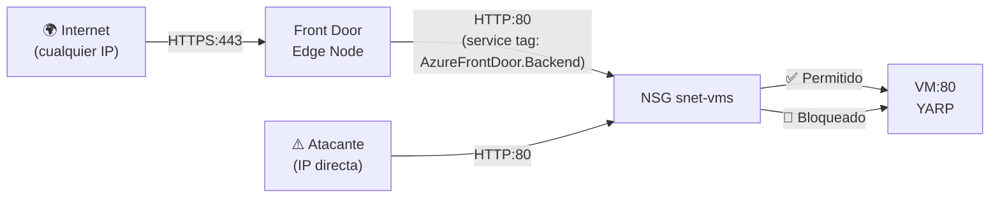

# Laboratorio 8: Escudo Perimetral — Front Door, YARP y el NSG Sellado

> **Objetivo:** Crear el punto de entrada único y seguro para todo el tráfico de Cosmos. Front Door es el portero global — recibe las peticiones HTTPS del mundo, las pasa a través del WAF, y las enruta al origen correcto: el frontend estático (Storage) o el API gateway (YARP en la VM).

---

## 📝 Paso 1: El Concepto — Por Qué Front Door + YARP

### 🤔 El Problema
Tenemos dos orígenes: el Storage Account (frontend) y la VM con YARP (API). ¿Cómo llega el tráfico de internet a ellos sin exponer sus IPs/URLs directamente?

Si la URL del Storage Account es pública, cualquiera puede accederla directamente, sin pasar por el WAF. Si la IP de la VM es pública, cualquiera puede intentar conectarse al puerto 80 sin pasar por Front Door.

### 💡 La Solución: El Modelo de Dos Capas de Cosmos
```
[Internet] ──HTTPS──► [Front Door] ──enruta──► [Storage Account (/*)]
                            │
                            └──/api/*──► [VM:80 → YARP → microservicios]
```

**Front Door** (capa global): Termina TLS, aplica WAF, cachea el frontend, enruta por path.

**YARP** (capa de aplicación): Reverse proxy .NET dentro de la VM. Recibe el tráfico de Front Door y lo enruta a los contenedores del Swarm según la ruta (ej: `/api/radicacion/*` → contenedor `radicacion-api`).

**El sello de seguridad**: El NSG de la VM solo acepta tráfico del service tag `AzureFrontDoor.Backend` en el puerto 80. Si alguien intenta conectarse a la IP pública de la VM directamente, el NSG lo bloquea. YARP además valida el header `X-Azure-FDID` para rechazar tráfico de otros tenants de Front Door.

Referencia: **[ADR-003: YARP como Application Gateway](file:///Users/didierymartinez/Documents/Sincosoft/Cosmos/cosmos/architecture/ADRs/003-adr-yarp-como-application-gateway.md)**

---

## 📝 Paso 2: El Guardián de Tráfico — NSG y el Sello de Front Door

### 🤔 El Problema
Tienes la VM en una subnet privada. Sin embargo, el tráfico **dentro** de la VNet tampoco debe fluir sin restricciones. Necesitas un mecanismo que decida explícitamente qué conexiones están permitidas hacia `snet-vms`. Sin este control, cualquier recurso de Azure dentro de la misma VNet podría acceder al puerto 80 de la VM.

Y más importante: en un Lab futuro (Lab 10) la VM estará accesible desde Front Door vía Private Link. ¿Cómo garantizamos que **solo** los edge nodes de Front Door pueden enviar tráfico HTTP a la VM y nadie más?

### 💡 La Solución: el NSG con el Sello de Front Door

El **NSG (Network Security Group)** es el firewall de red de Azure para subnets. Evalúa cada paquete que intenta entrar y decide si lo permite o bloquea, según **reglas** definidas por prioridad.

Cada regla tiene:
- **Prioridad**: 100–4096. Menor = mayor prioridad. El NSG evalúa en orden y aplica la primera que coincide.
- **Dirección**: `Inbound` (entrante) o `Outbound` (saliente).
- **Origen**: IP, rango CIDR o **Service Tag**. Los Service Tags son rangos IP gestionados por Microsoft (ej: `AzureFrontDoor.Backend` = todos los edge nodes de Front Door, actualizado automáticamente).
- **Puerto**: el puerto TCP/UDP afectado.
- **Acción**: `Allow` o `Deny`.

Además, Azure aplica **reglas implícitas de prioridad 65000+** a todo NSG:
- Inbound: deniega todo el tráfico de internet por defecto, permite tráfico de la misma VNet.
- Outbound: permite todo el tráfico saliente por defecto.

Las reglas que tú defines (prioridades 100–4096) siempre se evalúan antes que las implícitas.

**¿Por qué el NSG se refuerza aquí?** Porque ahora que tenemos Front Door, podemos cerrar la regla general de HTTP que abrimos en el Lab 1. Ahora solo permitiremos tráfico HTTP si viene de un edge node oficial de Microsoft Front Door.

### 🧩 Jerarquía de Seguridad


### 🚀 Ejecución

**Agrega esto a tu `main.tf`**:

```hcl
# 1. El Grupo de Seguridad (NSG)
resource "azurerm_network_security_group" "vm_nsg" {
  name                = "nsg-cosmos-dev-eus-001"
  location            = azurerm_resource_group.rg.location
  resource_group_name = azurerm_resource_group.rg.name
  tags                = azurerm_resource_group.rg.tags
}

# 2. La regla que solo permite a Front Door
resource "azurerm_network_security_rule" "allow_frontdoor_http" {
  name                        = "AllowHttpFromFrontDoor"
  priority                    = 100
  direction                   = "Inbound"
  access                      = "Allow"
  protocol                    = "Tcp"
  source_port_range           = "*"
  destination_port_range      = "80"
  source_address_prefix       = "AzureFrontDoor.Backend"
  destination_address_prefix  = "*"
  resource_group_name         = azurerm_resource_group.rg.name
  network_security_group_name = azurerm_network_security_group.vm_nsg.name
}

# 3. Asociación del NSG a la Subnet
resource "azurerm_subnet_network_security_group_association" "vm" {
  subnet_id                 = azurerm_subnet.vm_subnet.id
  network_security_group_id = azurerm_network_security_group.vm_nsg.id
}
```

### 🧠 Desglose del Código: Sellando la Red

*   **¿Qué es un Service Tag (`AzureFrontDoor.Backend`)?**: 
    Microsoft gestiona miles de servidores en todo el mundo para Front Door. Sus direcciones IP cambian constantemente. En lugar de que tú tengas que actualizar tu firewall cada vez que Microsoft añade un servidor, usas un **Service Tag**. Es una etiqueta inteligente que Azure traduce automáticamente a los rangos de IPs oficiales de Front Door.
*   **Prioridad 100**: 
    En un NSG, las reglas se evalúan de menor a mayor número. Al poner prioridad 100, nos aseguramos de que nuestra regla "pise" las reglas por defecto de Azure que bloquean el tráfico.
*   **El Sello de Seguridad**: 
    Nota que el `source_address_prefix` NO es `*` (Internet). Es específicamente Front Door. Esto significa que si alguien descubre la IP de tu VM e intenta entrar directamente al puerto 80, el NSG lo rechazará. La única puerta de entrada es a través de Front Door.


Aplica:

```bash
terraform apply -var-file=terraform.tfvars
```

### 🔍 Comprobación
1. Portal → NSG `nsg-cosmos-dev-eus-001` → **Inbound security rules** → verifica que aparece `AllowHttpFromFrontDoor` con prioridad 100.
2. Verifica `Source = AzureFrontDoor.Backend` y `Destination port = 80`.
3. Portal → VNet `vnet-cosmos-dev-eus-001` → **Subnets** → `snet-vms` debe mostrar `nsg-cosmos-dev-eus-001` en la columna **Security group**.

> 💡 **¿Por qué no hay regla de SSH?** La VM no tiene IP pública — principio Zero Public IP. El acceso administrativo se hace vía `az vm run-command invoke` (Lab 3), que usa el plano de gestión de Azure.

---


## 📝 Paso 3: El Perfil de Front Door y los Orígenes

### 🤔 El Problema
Front Door necesita saber a qué recursos enviar el tráfico. Necesita conocer: (1) el endpoint público, (2) los grupos de orígenes (backends), (3) las rutas (qué URL → qué origen).

### 💡 La Solución
La estructura de Front Door en Terraform es:
- **Profile** → el contenedor del servicio.
- **Endpoint** → la URL pública (`*.azurefd.net`).
- **Origin Group** → agrupa backends con el mismo propósito (ej: todos los nodos del Swarm).
- **Origin** → un backend concreto (el FQDN del Storage o de la VM).
- **Route** → la regla de enrutamiento (`/*` → origin group static, `/api/*` → origin group yarp).

### 🚀 Ejecución

**Agrega esto a tu `main.tf`**:

```hcl
# 1. El Perfil Global (El edificio)
resource "azurerm_cdn_frontdoor_profile" "fd" {
  name                = "afd-cosmos-dev-eus-${random_string.suffix.result}"
  resource_group_name = azurerm_resource_group.rg.name
  sku_name            = "Standard_AzureFrontDoor"
  tags                = azurerm_resource_group.rg.tags
}

# 2. El Endpoint (La puerta principal)
resource "azurerm_cdn_frontdoor_endpoint" "main" {
  name                     = "fde-cosmos-dev-eus-${random_string.suffix.result}"
  cdn_frontdoor_profile_id = azurerm_cdn_frontdoor_profile.fd.id
}

# 3. Grupo de Origen: Frontend Estático
resource "azurerm_cdn_frontdoor_origin_group" "static" {
  name                     = "static"
  cdn_frontdoor_profile_id = azurerm_cdn_frontdoor_profile.fd.id

  load_balancing {}
  health_probe {
    path      = "/"
    protocol  = "Https"
    interval_in_seconds = 100
  }
}

resource "azurerm_cdn_frontdoor_origin" "static" {
  name                          = "storage-web"
  cdn_frontdoor_origin_group_id = azurerm_cdn_frontdoor_origin_group.static.id
  host_name                     = azurerm_storage_account.frontend.primary_web_host
  origin_host_header            = azurerm_storage_account.frontend.primary_web_host
}

# 4. Ruta del Frontend: /*
resource "azurerm_cdn_frontdoor_route" "static" {
  name                          = "static"
  cdn_frontdoor_endpoint_id     = azurerm_cdn_frontdoor_endpoint.main.id
  cdn_frontdoor_origin_group_id = azurerm_cdn_frontdoor_origin_group.static.id
  cdn_frontdoor_origin_ids      = [azurerm_cdn_frontdoor_origin.static.id]
  patterns_to_match             = ["/*"]
  supported_protocols           = ["Http", "Https"]
  forwarding_protocol           = "HttpsOnly"
  link_to_default_domain        = true
}

# 5. Grupo de Origen: YARP (API)
resource "azurerm_cdn_frontdoor_origin_group" "yarp" {
  name                     = "yarp"
  cdn_frontdoor_profile_id = azurerm_cdn_frontdoor_profile.fd.id
  load_balancing {}
  health_probe {
    path     = "/healthz"
    protocol = "Http"
  }
}

resource "azurerm_cdn_frontdoor_origin" "yarp" {
  name                          = "yarp-vm"
  cdn_frontdoor_origin_group_id = azurerm_cdn_frontdoor_origin_group.yarp.id
  enabled                       = false 
  host_name                     = azurerm_network_interface.vm_nic.private_ip_address
  origin_host_header            = azurerm_network_interface.vm_nic.private_ip_address
}

# 6. Ruta del API: /api/*
resource "azurerm_cdn_frontdoor_route" "api" {
  name                          = "api"
  cdn_frontdoor_endpoint_id     = azurerm_cdn_frontdoor_endpoint.main.id
  cdn_frontdoor_origin_group_id = azurerm_cdn_frontdoor_origin_group.yarp.id
  cdn_frontdoor_origin_ids      = [azurerm_cdn_frontdoor_origin.yarp.id]
  patterns_to_match             = ["/api/*"]
  supported_protocols           = ["Http", "Https"]
  forwarding_protocol           = "HttpOnly"
  link_to_default_domain        = true
}

# 7. Outputs necesarios para validar el flujo
output "frontdoor_endpoint_url" {
  value = "https://${azurerm_cdn_frontdoor_endpoint.main.host_name}"
}

output "frontdoor_resource_guid" {
  value       = azurerm_cdn_frontdoor_profile.fd.resource_guid
  description = "ID del perfil — necesario para validar X-Azure-FDID en YARP"
}
```

### 🧠 Desglose del Código: ¿Cómo fluye el tráfico?

*   **Jerarquía Profile ➡️ Endpoint ➡️ Route ➡️ Origin**: 
    Piensa en el **Profile** como el edificio, el **Endpoint** como la puerta principal, las **Routes** como los pasillos que te dicen a dónde ir según tu petición (`/*` o `/api/*`), y los **Origins** como las habitaciones (recursos) finales.
*   **`HttpsOnly` en el Front**: 
    Obligamos a que cualquier conexión al frontend sea siempre encriptada. Si un usuario entra por HTTP, Front Door lo redirige automáticamente a HTTPS.
*   **El Origen YARP Deshabilitado**: 
    Nota que el origen `yarp-vm` está en `enabled = false`. Esto es porque nuestra VM está en una red privada y Front Door (que vive en internet) no puede verla todavía. En el Lab 10 resolveremos esto usando **Private Link**, que crea un "túnel" directo y privado entre Front Door y tu VM.
*   **Caching**: 
    Al usar Front Door para el Storage Account, los archivos del frontend se guardan en servidores cerca de tus usuarios en todo el mundo. Esto hace que Cosmos cargue casi instantáneamente sin importar si el usuario está en Colombia o en España.

Aplica:

```bash
terraform apply -var-file=terraform.tfvars
```

### 🔍 Comprobación
1. Portal → `rg-cosmos-dev-eus-001` → haz clic en el recurso de tipo **Front Door and CDN profiles**.
2. En **Overview** → verifica que el Endpoint tiene una URL como `fde-cosmos-dev-eus-XXXXXX.azurefd.net`.
3. En el panel izquierdo → **Origin groups** → verifica que existen `static` y `yarp`.
4. Abre el navegador → ve a `https://fde-cosmos-dev-eus-XXXXXX.azurefd.net/env.js` → debe mostrar el `env.js` que subiste en el Lab 5.
5. Ve a la ruta `/api/` → observarás un error (el health probe del origen `yarp` falla porque el Private Link no está configurado aún). Esto es correcto — lo resolveremos en el Lab 10.

> ⏱️ Front Door puede tardar hasta **10 minutos** en propagar la configuración globalmente.

### 🌍 Realidad Cosmos
El código Terraform de producción es prácticamente idéntico a este. La única diferencia: el SKU es `Premium_AzureFrontDoor` (incluye WAF policies) y hay una validación pendiente del header `X-Azure-FDID` en YARP (documentada como gap #8 en el código real). Archivo real: [`ApplicationPlane/infraestructure/front-door.tf`](file:///Users/didierymartinez/Documents/Sincosoft/Cosmos/cosmos/ApplicationPlane/infraestructure/front-door.tf).

---

**🏆 ¡Felicidades!** Cosmos ahora tiene un escudo profesional. Todo el tráfico mundial entra por un solo punto, está cacheado y enrutado inteligentemente.

**🤔 Sin embargo, queda una duda:**
La plataforma es segura, pero... **¿Qué pasa cuando tengamos 1,000 clientes? ¿Vamos a crear bases de datos y usuarios a mano? ¿Y si un error en el sistema de cobros (billing) tumba el ERP de todos? ¿Cómo separamos el cerebro que gestiona el negocio del cerebro que corre la aplicación?**

**➡️ Descúbrelo en el siguiente lab:** Abre `09_Lab_Control_Plane.md`.


Aplica:

```bash
terraform apply -var-file=terraform.tfvars
```

### 🔍 Comprobación
1. Portal → `rg-cosmos-dev-eus-001` → haz clic en el recurso de tipo **Front Door and CDN profiles**.
2. En **Overview** → verifica que el Endpoint tiene una URL como `fde-cosmos-dev-eus-XXXXXX.azurefd.net`.
3. En el panel izquierdo → **Origin groups** → verifica que existen `static` y `yarp`.
4. Abre el navegador → ve a `https://fde-cosmos-dev-eus-XXXXXX.azurefd.net/env.js` → debe mostrar el `env.js` que subiste en el Lab 5.
5. Ve a la ruta `/api/` → observarás un error (el health probe del origen `yarp` falla porque el Private Link no está configurado aún). Esto es correcto — lo resolveremos en el Lab 10.

> ⏱️ Front Door puede tardar hasta **10 minutos** en propagar la configuración globalmente.

### 🌍 Realidad Cosmos
El código Terraform de producción es prácticamente idéntico a este. La única diferencia: el SKU es `Premium_AzureFrontDoor` (incluye WAF policies) y hay una validación pendiente del header `X-Azure-FDID` en YARP (documentada como gap #8 en el código real). Archivo real: [`ApplicationPlane/infraestructure/front-door.tf`](file:///Users/didierymartinez/Documents/Sincosoft/Cosmos/cosmos/ApplicationPlane/infraestructure/front-door.tf).

---

---

**🏆 ¡Felicidades!** Cosmos ahora tiene un escudo profesional. Todo el tráfico mundial entra por un solo punto, está cacheado y enrutado inteligentemente.

**🤔 Sin embargo, queda una duda:**
La plataforma es segura, pero... **¿Qué pasa cuando tengamos 1,000 clientes? ¿Vamos a crear bases de datos y usuarios a mano? ¿Y si un error en el sistema de cobros (billing) tumba el ERP de todos? ¿Cómo separamos el cerebro que gestiona el negocio del cerebro que corre la aplicación?**

**➡️ Descúbrelo en el siguiente lab:** Abre `09_Lab_Control_Plane.md`.
