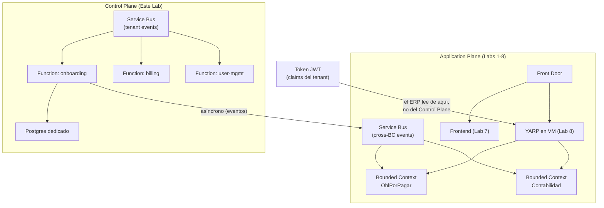

# Laboratorio 9: Los Dos Planos — Application Plane y Control Plane

> **Objetivo:** Entender la decisión arquitectónica más importante de Cosmos: el sistema tiene **dos cerebros separados**. El Application Plane sirve el ERP en tiempo real. El Control Plane gestiona el ciclo de vida de los tenants. No se comunican síncronamente.

---

## 📝 Paso 1: El Concepto — ¿Por Qué Dos Planos?

### 🤔 El Problema
Imagina que el sistema de facturación (billing) necesita aumentar el límite de usuarios de un tenant. ¿Debería ese proceso llamar directamente a la API del ERP para cambiar configuraciones? Si lo hace:
- Un bug en billing podría derribar el ERP de todos los tenants.
- Un pico de onboardings simultáneos ralentizaría el procesamiento de facturas del ERP.
- Un despliegue del billing requeriría coordinar con el equipo del ERP.

### 💡 La Solución: Separación de Planos (ADR-009)
Cosmos separa deliberadamente dos responsabilidades en infraestructuras independientes:

| | Application Plane | Control Plane |
|---|---|---|
| **Qué hace** | Sirve las APIs del ERP en tiempo real | Gestiona el ciclo de vida de tenants y plataforma |
| **Compute** | VM con Docker Swarm + YARP (Labs 3 y 8) | Function Apps (onboarding, billing, user-mgmt) |
| **Mensajería** | Service Bus para integración entre Bounded Contexts | Service Bus propio para eventos de tenants |
| **Datos** | Cada BC tiene su Postgres (Lab 6) | Postgres dedicado del Control Plane |
| **Repo Terraform** | `ApplicationPlane/infraestructure/` | `ControlPlane/infraestructura/aplicacion/` |

**La regla más importante:** Sin acoplamiento síncrono entre planos. Si el runtime del ERP necesita datos de un tenant (tier, permisos), los obtiene del **token JWT** — no con una llamada HTTP al Control Plane.

Referencia: **[ADR-009: Separación Application Plane / Control Plane](file:///Users/didierymartinez/Documents/Sincosoft/Cosmos/cosmos/architecture/ADRs/009-adr-separacion-application-plane-y-control-plane.md)**

### 🧩 La Arquitectura Completa de Cosmos


---

## 📝 Paso 2: El Service Bus del Application Plane

### 🤔 El Problema
Los Bounded Contexts del ERP necesitan comunicarse entre sí. Por ejemplo, cuando el módulo de Reconocimiento finaliza el procesamiento de un documento, debe notificar al módulo de Radicación. Si lo hace con una llamada HTTP directa, crea un acoplamiento síncrono que hace frágil al sistema.

### 💡 La Solución
El **Service Bus** desacopla los productores de los consumidores. Reconocimiento publica `reconocimiento.documento.procesado` al topic del Service Bus. Radicación tiene una subscription en ese topic y procesa el evento cuando puede. Si Radicación cae, el mensaje espera en la cola.

### 🚀 Ejecución

**Agrega esto a tu `main.tf`**:

```hcl
# 1. Service Bus del Application Plane (Para comunicación entre microservicios)
resource "azurerm_servicebus_namespace" "app_plane" {
  name                = "sb-cosmos-dev-eus-ap-${random_string.suffix.result}"
  location            = azurerm_resource_group.rg.location
  resource_group_name = azurerm_resource_group.rg.name
  sku                 = "Standard"
  tags                = azurerm_resource_group.rg.tags
}

# 2. Un Topic para eventos de un Bounded Context
resource "azurerm_servicebus_topic" "reconocimiento_events" {
  name         = "reconocimiento.events"
  namespace_id = azurerm_servicebus_namespace.app_plane.id
}

# 3. Permisos para la VM (Managed Identity)
resource "azurerm_role_assignment" "vm_sb_sender" {
  scope                = azurerm_servicebus_namespace.app_plane.id
  role_definition_name = "Azure Service Bus Data Sender"
  principal_id         = azurerm_linux_virtual_machine.vm.identity[0].principal_id
}

resource "azurerm_role_assignment" "vm_sb_receiver" {
  scope                = azurerm_servicebus_namespace.app_plane.id
  role_definition_name = "Azure Service Bus Data Receiver"
  principal_id         = azurerm_linux_virtual_machine.vm.identity[0].principal_id
}
```

### 🧠 Desglose del Código: El Mensajero del ERP

*   **¿Qué es un Service Bus?**: 
    Es un buzón de mensajes. En lugar de que el microservicio A llame al B por HTTP (síncrono), el A deja una nota en el Service Bus y sigue con su vida. El B recoge la nota cuando está libre. Esto hace que Cosmos sea extremadamente resistente a fallos.
*   **SKU `Standard`**: 
    Usamos Standard porque permite **Topics** y **Subscriptions**. Esto nos permite implementar el patrón *Pub/Sub*: un microservicio publica un evento y múltiples interesados pueden escucharlo sin que el emisor lo sepa.
*   **Managed Identity (De nuevo)**: 
    Observa que no estamos usando una "Connection String" con contraseña para el Service Bus. Le estamos dando el rol de "Sender" y "Receiver" directamente a la **Identidad** de la VM. Es más seguro y fácil de rotar.


### 🔍 Comprobación
1. Portal → `rg-cosmos-dev-eus-001` → haz clic en el recurso de tipo **Service Bus Namespace** (el del Application Plane).
2. En el panel izquierdo → **Topics** → verifica que existe `reconocimiento.events`.
3. En **Access control (IAM)** → **Role assignments** → verifica que la VM tiene `Azure Service Bus Data Sender` y `Azure Service Bus Data Receiver`.

### 🌍 Realidad Cosmos
En producción, la autenticación al Service Bus usa **Managed Identity** exclusivamente — sin SAS/connection strings. Esta es la decisión del ADR-004. Con `disableLocalAuth: true` en el namespace, no es posible conectarse con SAS aunque alguien lo intente. Ver [`ADR-004`](file:///Users/didierymartinez/Documents/Sincosoft/Cosmos/cosmos/architecture/ADRs/004-adr-managed-identity-en-service-bus.md).

---

## 📝 Paso 3: El Service Bus y las Function Apps del Control Plane

### 🤔 El Problema
¿Qué pasa cuando un cliente nuevo compra Cosmos? Alguien necesita: crear la base de datos del cliente, crear sus usuarios iniciales, configurar sus permisos, enviarle el correo de bienvenida. Si esto lo hace una API síncrona, el usuario espera 30 segundos viendo una pantalla de loading.

### 💡 La Solución
El Control Plane usa **Azure Functions** disparadas por eventos del Service Bus. El proceso de onboarding es:
1. El cliente completa el formulario de registro → el frontend llama a la API del Control Plane.
2. La API publica `tenant.registered` al Service Bus del CP.
3. La Function de onboarding consume el evento → crea la DB → crea usuarios → publica `tenant.provisioned`.
4. El frontend recibe la confirmación vía WebSocket (SignalR) minutos después.

El equipo del billing, el de user-mgmt y el de onboarding trabajan independientemente — cada uno tiene su Function App.

### 🚀 Ejecución

**Agrega esto a tu `main.tf`**:

```hcl
# 1. Service Bus del Control Plane (Eventos de Onboarding/Billing)
resource "azurerm_servicebus_namespace" "control_plane" {
  name                = "sb-cosmos-dev-eus-cp-${random_string.suffix.result}"
  location            = azurerm_resource_group.rg.location
  resource_group_name = azurerm_resource_group.rg.name
  sku                 = "Standard"
  tags                = azurerm_resource_group.rg.tags
}

resource "azurerm_servicebus_queue" "tenant_registered" {
  name         = "tenant.registered"
  namespace_id = azurerm_servicebus_namespace.control_plane.id
}

# 2. Observabilidad (Application Insights)
resource "azurerm_log_analytics_workspace" "control_plane" {
  name                = "law-cosmos-dev-eus-001"
  location            = azurerm_resource_group.rg.location
  resource_group_name = azurerm_resource_group.rg.name
  sku                 = "PerGB2018"
  tags                = azurerm_resource_group.rg.tags
}

resource "azurerm_application_insights" "control_plane" {
  name                 = "ai-cosmos-dev-eus-001"
  location             = azurerm_resource_group.rg.location
  resource_group_name  = azurerm_resource_group.rg.name
  application_type     = "web"
  workspace_id         = azurerm_log_analytics_workspace.control_plane.id
}

# 3. Plan de Servicio y Storage para Functions
resource "azurerm_service_plan" "control_plane" {
  name                = "asp-cosmos-dev-eus-001"
  location            = azurerm_resource_group.rg.location
  resource_group_name = azurerm_resource_group.rg.name
  os_type             = "Linux"
  sku_name            = "B3" 
}

resource "azurerm_storage_account" "control_plane_funcs" {
  name                     = "stcosmosdevcpfuncs${random_string.suffix.result}"
  resource_group_name      = azurerm_resource_group.rg.name
  location                 = azurerm_resource_group.rg.location
  account_tier             = "Standard"
  account_replication_type = "LRS"
}

# 4. Function App: Onboarding
resource "azurerm_linux_function_app" "onboarding" {
  name                = "func-onboarding-dev-eus-${random_string.suffix.result}"
  resource_group_name = azurerm_resource_group.rg.name
  location            = azurerm_resource_group.rg.location
  service_plan_id     = azurerm_service_plan.control_plane.id
  storage_account_name = azurerm_storage_account.control_plane_funcs.name
  storage_account_access_key = azurerm_storage_account.control_plane_funcs.primary_access_key

  identity { type = "SystemAssigned" }

  site_config {
    application_stack {
      dotnet_version              = "8.0"
      use_dotnet_isolated_runtime = true
    }
  }

  app_settings = {
    "ServiceBusConnection" = azurerm_servicebus_namespace.control_plane.default_primary_connection_string
    "APPLICATIONINSIGHTS_CONNECTION_STRING" = azurerm_application_insights.control_plane.connection_string
  }
}
```

### 🧠 Desglose del Código: El Cerebro Administrativo

*   **¿Por qué otro Service Bus?**: 
    Aislamiento. El tráfico de los usuarios usando el ERP no debe competir con el tráfico de "Onboarding" de nuevos clientes. Si el Service Bus del ERP se satura, el Control Plane debe seguir funcionando para que podamos gestionar la crisis.
*   **Application Insights**: 
    Esta es la "Caja Negra" del Control Plane. Aquí es donde vemos en tiempo real si el proceso de onboarding falló, cuánto tiempo tarda en crearse una base de datos y si hay errores en el código de las Functions.
*   **Dotnet Isolated Runtime**: 
    Cosmos usa el modelo *Isolated* de Azure Functions. Esto permite que el proceso de la función corra de forma independiente al proceso del host de Azure, dándonos control total sobre las dependencias de .NET 8.
*   **Asociación vía `app_settings`**: 
    Fíjate cómo conectamos la Function al Service Bus usando la variable `ServiceBusConnection`. En cuanto el código de la función "despierte", Azure le inyectará automáticamente la cadena de conexión para que empiece a escuchar eventos.


Aplica:

```bash
terraform apply -var-file=terraform.tfvars
# Las Function Apps tardan ~3-5 minutos en crearse.
```

### 🔍 Comprobación
1. Portal → `rg-cosmos-dev-eus-001` → verifica que ahora hay **dos Service Bus Namespaces**:
   - `sb-cosmos-dev-eus-ap-XXXXXX` (Application Plane — cross-BC events)
   - `sb-cosmos-dev-eus-cp-XXXXXX` (Control Plane — tenant lifecycle)
2. Haz clic en el Service Bus del CP → **Queues** → verifica `tenant.registered`.
3. Portal → Function App `func-onboarding-XXXXXX` → **Configuration** → verifica que `ServiceBusConnection` apunta al SB del Control Plane.
4. Entra a **Application Insights** `ai-cosmos-dev-eus-001` → **Live Metrics** → debe mostrar el telemetry de las functions.

### 🌍 Realidad Cosmos
En producción hay 5 Function Apps en el Control Plane: `onboarding`, `user-management`, `tenant-provisioning`, `tenant-management` y `billing`. Cada una en su propio archivo Terraform. El Service Plan usa SKU `B3` (4 vCPU). El código fuente del Control Plane vive en [`ControlPlane/src/`](file:///Users/didierymartinez/Documents/Sincosoft/Cosmos/cosmos/ControlPlane/src/). Archivos Terraform reales: [`ControlPlane/infraestructura/aplicacion/`](file:///Users/didierymartinez/Documents/Sincosoft/Cosmos/cosmos/ControlPlane/infraestructura/aplicacion/).

---

---

**🏆 ¡Felicidades!** Has construido los dos cerebros de Cosmos. Tienes una plataforma que puede gestionar miles de clientes de forma independiente y segura.

**🤔 Sin embargo, queda una última duda:**
Todo funciona, pero si miras el Key Vault o la Base de Datos en el portal, verás que aún tienen endpoints públicos. **¿Cómo logramos que Cosmos sea 100% privado? ¿Cómo sellamos la red para que ni siquiera existan IPs públicas para nuestros servicios internos?**

**➡️ Descúbrelo en el reto final:** Abre `10_Lab_Hardening.md`.
