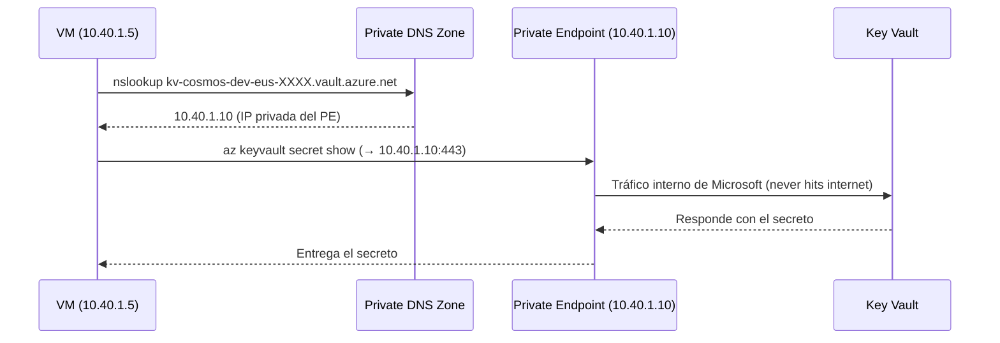
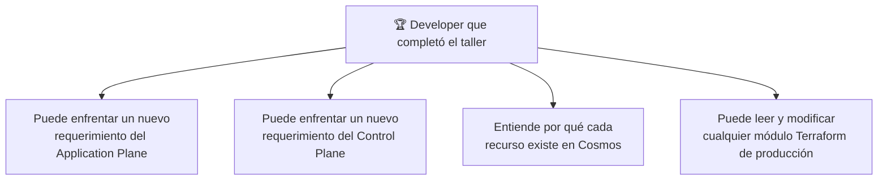

# Laboratorio 10: Hardening — Private Link, DNS Privado y el Delta a Producción

> **Objetivo:** Aplicar el endurecimiento de seguridad que convierte la arquitectura de dev en apta para producción. El cambio central: los servicios PaaS (Key Vault, PostgreSQL) dejan de tener endpoints públicos y pasan a ser accesibles solo desde dentro de la VNet, mediante Private Endpoints y Private DNS Zones.

---

## 📝 Paso 1: El Concepto — Por Qué Private Link

### 🤔 El Problema
El Key Vault y el PostgreSQL que creamos en los Labs 4 y 6 son servicios PaaS con endpoints públicos (`kv-cosmos-dev-eus-XXXX.vault.azure.net`, `psql-cosmos-dev-eus-XXXX.postgres.database.azure.com`). Aunque tienen firewalls, cualquier IP del mundo puede intentar conectarse a ellos. En producción, este modelo no es aceptable.

### 💡 La Solución: Private Endpoint
Un **Private Endpoint** es una interfaz de red con una IP privada dentro de tu Subnet (`10.40.2.X`). Esta NIC privada se conecta directamente al servicio PaaS. Una vez creado el Private Endpoint:
1. El servicio PaaS puede configurarse para rechazar todo tráfico público.
2. El tráfico desde la VM al KV/DB nunca sale de la VNet — viaja por la red privada de Microsoft.

### 🤔 El Problema del DNS
Si creas el Private Endpoint pero no configuras DNS, cuando la VM hace `az keyvault secret show --vault-name kv-cosmos-dev-eus-XXXX.vault.azure.net`, el DNS resuelve a la **IP pública** del KV (aunque el PE exista). El tráfico sigue yendo por internet.

La solución es la **Private DNS Zone**: una zona DNS privada que sobreescribe la resolución de `*.vault.azure.net` con la IP privada del PE (`10.40.2.X`).

Referencia: **[ADR-005: Private DNS Zones centralizadas](file:///Users/didierymartinez/Documents/Sincosoft/Cosmos/cosmos/architecture/ADRs/005-adr-private-dns-zones-centralizadas.md)**

### 🧩 El Flujo con Private Link


---

## 📝 Paso 2: Private Endpoint del Key Vault

### 🚀 Ejecución

**Agrega esto a tu `main.tf`**:

```hcl
# 1. Subnet dedicada para Private Endpoints
resource "azurerm_subnet" "pe_subnet" {
  name                 = "snet-pe"
  resource_group_name  = azurerm_resource_group.rg.name
  virtual_network_name = azurerm_virtual_network.vnet.name
  address_prefixes     = ["10.40.2.0/24"]
}

# 2. Zona DNS Privada para Key Vault
resource "azurerm_private_dns_zone" "kv" {
  name                = "privatelink.vaultcore.azure.net"
  resource_group_name = azurerm_resource_group.rg.name
}

resource "azurerm_private_dns_zone_virtual_network_link" "kv" {
  name                  = "link-kv-dev-eus"
  resource_group_name   = azurerm_resource_group.rg.name
  private_dns_zone_name = azurerm_private_dns_zone.kv.name
  virtual_network_id    = azurerm_virtual_network.vnet.id
}

# 3. Private Endpoint del Key Vault
resource "azurerm_private_endpoint" "kv_pe" {
  name                = "pe-kv-cosmos-dev-eus-001"
  location            = azurerm_resource_group.rg.location
  resource_group_name = azurerm_resource_group.rg.name
  subnet_id           = azurerm_subnet.pe_subnet.id

  private_service_connection {
    name                           = "kv-link"
    private_connection_resource_id = azurerm_key_vault.kv.id
    subresource_names              = ["vault"]
    is_manual_connection           = false
  }

  private_dns_zone_group {
    name                 = "kv-dns-group"
    private_dns_zone_ids = [azurerm_private_dns_zone.kv.id]
  }
}

# 4. SELLADO: Bloquear el acceso público al Key Vault
resource "azurerm_key_vault_network_acl" "kv_acl" {
  key_vault_id = azurerm_key_vault.kv.id
  default_action             = "Deny"
  bypass                     = ["AzureServices"]
  virtual_network_subnet_ids = [azurerm_subnet.pe_subnet.id]
}
```

### 🧠 Desglose del Código: Sellando el cofre

*   **Subnet `snet-pe`**: 
    Es una buena práctica separar los Private Endpoints en su propia subnet. Esto permite aplicar políticas de red diferentes a las de las VMs y evita que se agoten las IPs de la subnet principal.
*   **¿Qué es la Private DNS Zone?**: 
    Cuando intentas entrar a `mi-kv.vault.azure.net`, el internet te dirá que la IP es pública. Al crear esta zona y linkearla a tu VNet, le estás diciendo a tus servidores: "Ignora lo que diga el internet; dentro de esta red, ese nombre de dominio apunta a la IP privada `10.40.2.4`".
*   **`subresource_names = ["vault"]`**: 
    Un recurso de Azure puede tener múltiples funciones. Para el Key Vault, el recurso que queremos privatizar es el "vault" (el almacenamiento de secretos).
*   **`default_action = "Deny"`**: 
    Este es el momento de la verdad. Al aplicar esta línea, el Key Vault **desaparece de internet**. A partir de ahora, solo los recursos dentro de tu VNet pueden leer secretos. Si intentas ver un secreto desde el portal de Azure en tu casa, verás un error de "Access Denied" (a menos que añadas tu IP a la lista blanca).


Aplica:

```bash
terraform apply -var-file=terraform.tfvars
```

### 🔍 Comprobación
1. Portal → Key Vault → **Networking** → verifica que en **Firewalls and virtual networks** el default action es **Deny**.
2. En el panel izquierdo → **Private endpoint connections** → verifica que `pe-kv-cosmos-dev-eus-001` está **Approved**.
3. Haz clic en el Private Endpoint → en **DNS configuration** → verifica que existe un registro A con una IP `10.40.2.X`.
4. Verifica la resolución desde la VM (SSH):
   ```bash
   # Antes del PE: resolvía a una IP pública (40.X.X.X)
   # Después del PE: debe resolver a una IP privada (10.40.2.X)
   nslookup kv-cosmos-dev-eus-XXXXXX.vault.azure.net
   # Respuesta esperada: Address: 10.40.2.4 (o similar)
   ```

### 🌍 Realidad Cosmos
En producción, las Private DNS Zones se crean en la VNet del Application Plane (el hub) con VNet Links a todas las VNets de cada Bounded Context. La regla: sin PE, sin acceso a servicios PaaS. ADR-005 documenta las 7 zonas que se crean: `privatelink.vaultcore.azure.net`, `privatelink.servicebus.windows.net`, `privatelink.azurecr.io`, entre otras.

---

## 📝 Paso 3: Private Endpoint del PostgreSQL

### 🚀 Ejecución

**Agrega esto a tu `main.tf`**:

```hcl
# 1. Zona DNS Privada para PostgreSQL
resource "azurerm_private_dns_zone" "postgres" {
  name                = "privatelink.postgres.database.azure.com"
  resource_group_name = azurerm_resource_group.rg.name
}

resource "azurerm_private_dns_zone_virtual_network_link" "postgres" {
  name                  = "postgres-dns-link"
  resource_group_name   = azurerm_resource_group.rg.name
  private_dns_zone_name = azurerm_private_dns_zone.postgres.name
  virtual_network_id    = azurerm_virtual_network.vnet.id
}

# 2. Private Endpoint del PostgreSQL
resource "azurerm_private_endpoint" "db_pe" {
  name                = "pe-db-cosmos-dev-eus-001"
  location            = azurerm_resource_group.rg.location
  resource_group_name = azurerm_resource_group.rg.name
  subnet_id           = azurerm_subnet.pe_subnet.id

  private_service_connection {
    name                           = "db-link"
    private_connection_resource_id = azurerm_postgresql_flexible_server.db.id
    subresource_names              = ["postgresqlServer"]
    is_manual_connection           = false
  }

  private_dns_zone_group {
    name                 = "db-dns-group"
    private_dns_zone_ids = [azurerm_private_dns_zone.postgres.id]
  }
}
```

### 🧠 Desglose del Código: Datos 100% Privados

*   **`subresource_names = ["postgresqlServer"]`**: 
    A diferencia del Key Vault, el subrecurso para la base de datos se llama específicamente `postgresqlServer`. Este nombre es fundamental; si te equivocas, el túnel privado no se establecerá.
*   **Adiós al Firewall de IP**:
    ¿Recuerdas el Lab 6 donde permitimos la IP pública de la VM en el firewall de Postgres? Con Private Link, esa regla ya no es necesaria. El tráfico ahora fluye por la "red de atrás", directamente a través de la interfaz de red privada.
*   **DNS Group**: 
    Al usar el bloque `private_dns_zone_group`, le pedimos a Azure que, en cuanto el PE reciba una IP (ej: `10.40.2.5`), cree automáticamente un registro en nuestra zona DNS privada. Esto garantiza que la VM siempre encuentre la base de datos sin que tú tengas que mapear IPs a mano.


Aplica:

```bash
terraform apply -var-file=terraform.tfvars
```

### 🔍 Comprobación
1. Verifica la resolución desde la VM:
   ```bash
   nslookup psql-cosmos-dev-eus-XXXXXX.postgres.database.azure.com
   # Respuesta esperada: Address: 10.40.2.5 (IP privada, no pública)
   ```
2. Verifica que la conexión a la DB sigue funcionando (ahora vía IP privada):
   ```bash
   az login --identity
   CONN=$(az keyvault secret show --vault-name kv-cosmos-dev-eus-XXXXXX --name db-connection-string --query value -o tsv)
   psql "$CONN" -c "SELECT 'Private Link funcionando!' as status;"
   ```

---

## 📝 Paso 4: El Delta Entre Dev y Producción

### 🧩 Comparativa Dev (Taller) vs Producción (Cosmos)

| Componente | Taller (Este Lab) | Producción (Cosmos) |
|---|---|---|
| **VM** | `Standard_D2s_v3` (2 vCPU) | `Standard_D8as_v7` (8 vCPU, 32 GB) |
| **Docker** | Single-node Swarm | 3+ manager nodes (Swarm HA, ADR-006) |
| **PostgreSQL** | `B_Standard_B2s` burstable | SKU de producción con High Availability |
| **Front Door** | Standard (sin WAF) | Premium + WAF policies (ADR-007) |
| **Private Endpoints** | KV + Postgres | KV + Postgres + Service Bus + ACR + Azure Monitor |
| **Private DNS Zones** | 2 zones (KV + Postgres) | 7 zones (ADR-005) |
| **Backend TF State** | Local (`.tfstate`) | Azure Blob Storage remoto |
| **CI/CD Infra** | Manual (`terraform apply`) | OIDC + GitHub Actions (infra-apply.yml) |
| **SSH Access** | IP pública directa | Azure Bastion (sin IP pública expuesta) |

### 🌍 Los Siguientes Pasos en una Producción Real
1. **Backend remoto**: Ejecutar `bootstrap-tfstate-backend.sh` para crear el Storage Account del state y migrar con `terraform init -migrate-state`.
2. **OIDC para CI/CD**: Ejecutar `bootstrap-github-oidc.sh` para crear el Service Principal con federated credentials y subir los secretos a GitHub Actions.
3. **Swarm HA**: Agregar 2 nodos más al Swarm (`docker swarm join`) y configurar un Internal Load Balancer zonal.
4. **Front Door Premium + WAF**: Cambiar `sku_name = "Premium_AzureFrontDoor"` y agregar `azurerm_cdn_frontdoor_firewall_policy`.
5. **Azure Bastion**: Crear `azurerm_bastion_host` y eliminar la IP pública de la VM.

---

## 🏆 Conclusión: Has Construido Cosmos

Al completar los 10 laboratorios, ahora puedes responder las preguntas que definen a un Ingeniero de Plataforma de Cosmos:

1. ✅ **¿Por qué hay dos Service Buses?** — Application Plane (cross-BC events) vs Control Plane (tenant lifecycle). ADR-009.
2. ✅ **¿Por qué YARP y no Azure Application Gateway?** — .NET fluency, control de middleware, costo. ADR-003.
3. ✅ **¿Por qué la VM tiene SystemAssigned Identity?** — Para negociar con KV, ACR (3 roles) y Service Bus sin secretos.
4. ✅ **¿Cómo el runner sabe el PAT sin tenerlo en código?** — cloud-init → az login --identity → KV (retries por propagación AAD).
5. ✅ **¿Por qué el NSG solo permite AzureFrontDoor.Backend:80?** — Todo el tráfico pasa por Front Door. ADR-007.
6. ✅ **¿Cómo el frontend recibe la URL de la API sin recompilarse?** — env.js generado desde secrets del KV en cada deploy.
7. ✅ **¿Qué hace Docker Swarm?** — Orquesta contenedores con overlay networks, gestiona deployments y rolling updates.
8. ✅ **¿Qué pasa cuando un tenant se registra?** — API Control Plane → SB CP → Function Onboarding → DB CP → evento asíncrono.


