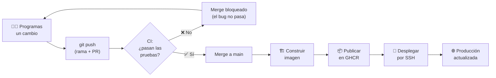

# Lección 10.3 — El ciclo completo de punta a punta

> ⏱️ 25 minutos · 🎯 **Al terminar:** harás un cambio real y lo verás llegar **solo** a producción: pruebas, construcción y despliegue, todo automático. Habrás cerrado el ciclo de vida completo del software moderno.

---

## 🤔 El problema

Ya tienes CI (pruebas, Fase 7) y CD (despliegue, Fase 10.2). Falta verlos trabajar **juntos**, en un cambio real, para sentir la diferencia con el dolor manual de la Fase 9.

---

## 🛠️ Manos a la obra

### Paso 1: Un cambio que pide el negocio

El área comercial quiere ver también cuántas empresas están **inactivas** en el resumen. En tu máquina, edita el endpoint `/empresas/resumen` en `src/GestionEmpresas.Api/Program.cs`:

```csharp
app.MapGet("/empresas/resumen", (IEmpresaRepositorio repo) =>
{
    var empresas = repo.ObtenerTodas().ToList();
    return Results.Ok(new
    {
        total = empresas.Count,
        activas = empresas.Count(e => e.Activa),
        inactivas = empresas.Count(e => !e.Activa),   // ← nuevo
    });
});
```

### Paso 2: Subirlo — y no hacer nada más

```bash
git checkout -b feat/resumen-inactivas
git add .
git commit -m "incluir empresas inactivas en el resumen"
git push -u origin feat/resumen-inactivas
```

Abre el Pull Request. Observa lo que pasa **solo**, sin que toques nada:

1. **CI (Fase 7):** el check de pruebas corre sobre tu PR. Si está verde, es seguro fusionar.
2. Fusiona el PR a `main`.
3. **CD (Fase 10):** al entrar a `main`, el pipeline de despliegue arranca: construye la imagen nueva, la publica en GHCR y la despliega en tu servidor.

Ve a la pestaña **Actions** y míralo en vivo. En dos o tres minutos, sin que hayas tocado el servidor, visita:

```
http://<IP>:5000/empresas/resumen
```

El nuevo campo `inactivas` ya está ahí, **en producción**. 🎉

### Paso 3: Comparar con el dolor de la Fase 9

Recuerda los seis pasos manuales de la Fase 9 (editar, probar, commit, push, scp, ssh + rebuild). Compara:

```
Fase 9 (manual):                       Fase 10 (automático):
  editar                                 editar
  probar a mano                          commit + push
  commit + push                          (… GitHub hace el resto …)
  scp al servidor               →        ✓ corre las pruebas (CI)
  ssh al servidor                        ✓ construye la imagen
  docker compose up --build              ✓ la publica en GHCR
  (y rezar que no rompiste nada)         ✓ la despliega en el servidor
```

De seis pasos manuales y frágiles, a **dos** (editar y `push`) — con la garantía de que las pruebas se ejecutaron. Eso es trabajar como en la industria.

---

## 🔁 El ciclo de vida completo que construiste



Este es el flujo que usan los equipos de software profesionales. Lo recorriste entero, entendiendo cada pieza.

---

## ✅ Compruébalo

> 🔮 **Predice, luego compruébalo.** Fusionaste el PR y **no tocaste el servidor**. *¿Crees que tu cambio aparecerá solo en `http://<IP>:5000/empresas/resumen`? ¿en cuánto tiempo?* Escribe tu respuesta y espera a que el CD termine.

- [ ] Hiciste un cambio, abriste un PR y viste el **CI** correr las pruebas.
- [ ] Al fusionar, el **CD** construyó, publicó y desplegó solo.
- [ ] El cambio apareció en `http://<IP>:5000/empresas/resumen` sin que tocaras el servidor.
- [ ] Puedes explicar la diferencia entre el flujo manual (Fase 9) y el automático (Fase 10).

> 🚦 **Cómo te fue:** 🟢 viví el ciclo CI/CD completo y lo entendí · 🟡 me costó · 🔴 no me alcanzó.

---

## 🧠 Lo que aprendiste

- **CI + CD juntos:** un `push` dispara pruebas, construcción, publicación y despliegue, en cadena.
- El despliegue pasó de **seis pasos manuales** a **dos** (editar y `push`), con pruebas garantizadas.
- Tienes el **ciclo de vida completo** automatizado: del editor a producción, solo.

---

## 🏁 Cierre de la Fase 10

Lograste lo que prometía el taller: *"escribo código, lo subo, y la aplicación se actualiza sola, de forma segura"*. Pasaste de copiar archivos y rezar, a un flujo profesional y automático.

Queda un último tema: hasta ahora la app y la base de datos viven en la **misma** máquina, expuesta a internet. En la fase final separaremos las piezas y las protegeremos, como en una arquitectura de producción de verdad.

---

**➡️ Siguiente fase:** [Fase 11 — Arquitectura de verdad](../11-arquitectura-real/README.md)
